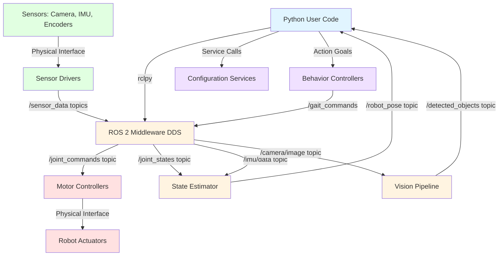

# Module 1: ROS 2 Fundamentals for Humanoid Robotics

## What You'll Learn

Welcome to the foundation of modern robotics software! This module introduces **ROS 2 (Robot Operating System 2)**, the middleware that serves as the "nervous system" for humanoid robots. Just as your nervous system coordinates signals between your brain, sensors, and muscles, ROS 2 coordinates communication between software components that perceive, plan, and control robotic movements.

By the end of this module, you'll understand:

- **ROS 2 Core Architecture**: Nodes, topics, services, and actions
- **Communication Patterns**: When to use asynchronous topics vs synchronous services vs long-running actions
- **Python Integration**: Writing ROS 2 programs using the `rclpy` library
- **Robot Modeling**: Describing humanoid robot structure using URDF (Unified Robot Description Format)
- **System Integration**: How Python code connects to robot controllers and actuators

## Why ROS 2 for Humanoid Robots?

Humanoid robots are complex systems with dozens of sensors, actuators, and computational processes running simultaneously. A typical humanoid needs to:

- **Process sensor data** from cameras, IMUs, force sensors, and joint encoders at high frequencies
- **Execute motor commands** for 20+ degrees of freedom (legs, arms, torso, head)
- **Run perception algorithms** for vision, balance, and environment understanding
- **Coordinate tasks** like walking while maintaining balance while tracking objects

Managing this complexity manually would be overwhelming. ROS 2 provides:

1. **Modularity**: Break complex systems into independent, manageable components (nodes)
2. **Interoperability**: Standard interfaces let different software components communicate seamlessly
3. **Scalability**: Distribute computation across multiple processors or computers
4. **Reliability**: Quality-of-Service (QoS) policies ensure critical data arrives on time
5. **Community**: Thousands of pre-built packages for navigation, perception, manipulation, and more

### ROS 2 vs ROS 1 (Context)

If you've heard of "ROS" before, you might wonder about the "2." ROS 2 is a complete redesign that addresses limitations of the original ROS:

- **Real-time capable**: Supports deterministic communication for time-critical control
- **Production-ready**: Security, quality-of-service, and lifecycle management for deployed robots
- **Multi-platform**: Runs on Linux, Windows, macOS, and embedded systems
- **DDS middleware**: Industry-standard Data Distribution Service for reliable networking

This book focuses exclusively on ROS 2 (we assume you're starting fresh). If you're familiar with ROS 1, you'll find many concepts similar but with improved implementations.

## Learning Objectives

After completing this module, you will be able to:

1. **Explain ROS 2 concepts** using humanoid robotics examples
   - Define nodes, topics, services, and actions
   - Identify why humanoid control systems use multiple independent nodes

2. **Select appropriate communication patterns** for robotics tasks
   - Choose topics for continuous sensor streams
   - Choose services for immediate queries
   - Choose actions for goal-oriented tasks with feedback

3. **Interpret URDF robot descriptions**
   - Read URDF XML structure
   - Identify links (rigid body parts) and joints (connections)
   - Understand how URDF maps to simulated and real robots

4. **Trace data flow** in ROS 2 systems
   - Follow commands from Python scripts through middleware to controllers
   - Understand feedback loops for sensor data

## Prerequisites

This module assumes you have:

- **Basic Python programming**: Variables, functions, loops, classes, and object-oriented concepts
- **Command-line familiarity**: Navigating directories, running scripts, installing packages
- **Robotics curiosity**: No prior ROS or robotics experience required!

**What you don't need**: Prior ROS 1 experience, C++ knowledge, or hardware robotics background.

## Module Structure

This module contains four main sections:

### 1. [Nodes and Topics](./nodes-topics.md)
Learn about **nodes** (independent processes) and **topics** (asynchronous communication channels). You'll see how sensor data flows through a humanoid robot's software stack using the publish-subscribe pattern.

**Key Concepts**: Process isolation, publish-subscribe, many-to-many communication, asynchronous messaging

### 2. [Services and Actions](./services-actions.md)
Understand **services** (synchronous request-response) and **actions** (long-running tasks with feedback). Learn when to use each pattern for humanoid control tasks.

**Key Concepts**: Client-server pattern, synchronous vs asynchronous, goal-oriented execution, preemptable tasks

### 3. [URDF Robot Modeling](./urdf-modeling.md)
Explore how **URDF** (Unified Robot Description Format) describes a humanoid robot's physical structure, kinematics, and dynamics. See how the same URDF file drives simulation, visualization, and real robot control.

**Key Concepts**: Links, joints, kinematic chains, collision geometry, visual representation

### 4. System Architecture (covered in section 1)
Understand how all these concepts integrate: Python code → ROS 2 middleware → robot controllers → actuators, with sensor feedback completing the loop.

**Key Concepts**: Data flow, control loops, system integration, middleware architecture

## Installation and Setup

This module focuses on **concepts and architecture**, not installation procedures. To follow along with code examples or run your own experiments, you'll need ROS 2 installed.

**Official Installation Guide**: [ROS 2 Humble Installation](https://docs.ros.org/en/humble/Installation.html)

We recommend:
- **ROS 2 Humble Hawksbill** (LTS release, supported through 2027)
- **Ubuntu 22.04** (most common platform, best community support)
- Alternatively, use [Docker containers](https://docs.ros.org/en/humble/How-To-Guides/Run-2-nodes-in-single-or-separate-docker-containers.html) for quick setup

All code examples in this module use Python (`rclpy`), not C++. If you can run `python3`, you're ready to learn!

## How to Use This Module

1. **Read sequentially**: Start with Nodes and Topics, then Services and Actions, then URDF Modeling
2. **Study code examples**: Each section includes annotated Python examples—read them carefully
3. **Visualize architectures**: Pay attention to diagrams showing how components connect
4. **Follow external links**: When you want deeper details, explore the official ROS 2 documentation
5. **Think in humanoid examples**: Every concept is explained with humanoid robotics applications

## ROS 2 System Architecture

Here's how all these concepts integrate in a humanoid robot control system:

**Data Flow:**
1. **Sensors** (cameras, IMUs, encoders) provide raw data through driver nodes
2. **ROS 2 Middleware** distributes sensor data via topics
3. **Processing Nodes** (state estimation, vision) analyze data and publish results
4. **Python User Code** receives processed data and makes decisions
5. **Commands** flow back through middleware to motor controllers
6. **Actuators** execute movements based on commands
7. **Feedback loop** completes as sensors observe the results

This architecture enables modular development—you can replace the vision pipeline, add new sensors, or upgrade controllers without changing the entire system.

## What's Next?

After mastering ROS 2 fundamentals, you'll be ready to:

- **Module 2**: Simulate humanoid robots in Gazebo and Unity
- **Module 3**: Add AI-driven perception and navigation with NVIDIA Isaac
- **Module 4**: Build autonomous systems using Vision-Language-Action models

ROS 2 is the foundation for everything that follows. Let's begin by understanding how nodes and topics enable modular robot software!

---

**Ready to start?** Continue to [Nodes and Topics](./nodes-topics.md) to learn about ROS 2's fundamental building blocks.

## References

Open Robotics. (2024). *ROS 2 Documentation: Humble Hawksbill*. https://docs.ros.org/en/humble/
