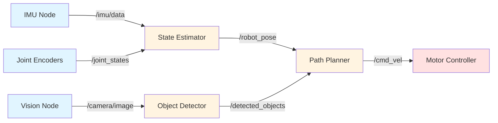

# Nodes and Topics: The Foundation of ROS 2 Communication

## Introduction

Imagine a humanoid robot walking while simultaneously processing camera data, maintaining balance, and planning its next step. Each of these tasks requires different algorithms, runs at different speeds, and may even execute on different processors. How do you coordinate all this complexity?

The answer is **ROS 2 nodes** and **topics**. This architectural pattern breaks your robot's software into independent, single-purpose processes that communicate through standardized message channels. Let's explore how this works.

## What is a ROS 2 Node?

A **node** is an independent process that performs a specific computational task. Think of nodes as specialized workers in a factory—each has one job and does it well.

### Key Characteristics of Nodes

1. **Single Responsibility**: Each node focuses on one task
   - A camera node publishes image data
   - A balance controller node processes IMU readings
   - A motor driver node sends commands to actuators

2. **Process Isolation**: Nodes run as separate operating system processes
   - If one node crashes, others continue running
   - Easier to debug and test individual components
   - Can be written in different programming languages (Python, C++)

3. **Independent Lifecycle**: Nodes can start, stop, and restart independently
   - Replace a faulty perception node without restarting motor control
   - Hot-swap algorithms during development

### Humanoid Example: Multi-Node Architecture

A walking humanoid might use these nodes simultaneously:

```
vision_node          → Processes camera images
imu_node             → Reads balance sensors
foot_sensor_node     → Monitors ground contact
balance_controller   → Computes stability corrections
gait_planner         → Generates walking patterns
motor_controller     → Sends joint commands to hardware
state_estimator      → Fuses sensor data for robot pose
```

Each node operates independently, but they must **communicate**. That's where topics come in.

## What is a Topic?

A **topic** is a named communication channel that nodes use to exchange messages. Topics implement the **publish-subscribe pattern**:

- **Publishers** send (publish) messages to a topic
- **Subscribers** receive (subscribe to) messages from a topic
- Publishers and subscribers don't know about each other—they only know the topic name

### Publish-Subscribe Pattern

This decoupling is powerful:

```
Publisher Node  →  /joint_states topic  →  Subscriber Node(s)
```

- **One-to-Many**: One publisher, multiple subscribers (broadcast sensor data)
- **Many-to-One**: Multiple publishers, one subscriber (aggregating data)
- **Many-to-Many**: Multiple publishers and subscribers (flexible architectures)

### Topic Naming Convention

Topics use hierarchical names starting with `/`:

```
/camera/image_raw          (camera images)
/imu/data                  (IMU measurements)
/joint_states              (current joint positions/velocities)
/cmd_vel                   (velocity commands for mobile base)
/humanoid/head/pan_tilt    (head motor commands)
```

Good names are descriptive and follow namespace conventions to avoid conflicts.

## Messages: The Data on Topics

Topics carry **messages**—structured data packets. ROS 2 provides standard message types, and you can define custom ones.

### Common Standard Message Types

```python
# String messages
std_msgs/String             → Simple text

# Numeric messages
std_msgs/Float64            → Single floating-point number
geometry_msgs/Twist         → Linear and angular velocity (for mobile robots)

# Sensor messages
sensor_msgs/Image           → Camera images
sensor_msgs/Imu             → Accelerometer and gyroscope data
sensor_msgs/JointState      → Joint positions, velocities, efforts

# Geometry messages
geometry_msgs/Pose          → Position and orientation
geometry_msgs/Transform     → Coordinate frame transformations
```

### Message Structure Example

A `sensor_msgs/JointState` message might contain:

```
name: ['left_shoulder', 'left_elbow', 'right_shoulder', 'right_elbow']
position: [0.5, 1.2, 0.3, 1.1]  # radians
velocity: [0.1, 0.0, 0.2, 0.0]  # rad/s
effort: [2.5, 1.8, 3.0, 2.0]    # torque in Nm
```

## Asynchronous Communication

Topics are **asynchronous**—publishers send messages without waiting for subscribers to receive them. This is critical for robotics:

- **High-frequency sensors** (cameras at 30 Hz, IMUs at 100 Hz) publish continuously
- **Subscribers process when ready**, not on the publisher's schedule
- **No blocking**: A slow subscriber doesn't stall the publisher

### Quality of Service (QoS)

ROS 2 introduces **QoS policies** to fine-tune communication reliability:

- **Reliable**: Guarantee delivery (important for commands)
- **Best Effort**: Send and forget (acceptable for high-frequency sensor streams)
- **History Depth**: How many messages to buffer
- **Durability**: Should late-joining subscribers receive old messages?

For humanoid control:
- **Balance control commands**: Reliable, small history depth
- **Camera images**: Best effort (if you miss one, next frame arrives soon)
- **Joint state feedback**: Reliable, keep latest value only

## Code Example 1: Minimal Publisher

Let's write a simple node that publishes joint state data for a humanoid's left arm.

```python
import rclpy
from rclpy.node import Node
from sensor_msgs.msg import JointState

class ArmJointPublisher(Node):
    def __init__(self):
        super().__init__('arm_joint_publisher')

        # Create a publisher for the /arm/joint_states topic
        self.publisher_ = self.create_publisher(
            JointState,           # Message type
            '/arm/joint_states',  # Topic name
            10                    # QoS history depth
        )

        # Publish at 10 Hz
        self.timer = self.create_timer(0.1, self.publish_joint_state)
        self.get_logger().info('Arm joint publisher started')

    def publish_joint_state(self):
        msg = JointState()
        msg.header.stamp = self.get_clock().now().to_msg()
        msg.name = ['left_shoulder', 'left_elbow']
        msg.position = [0.5, 1.2]  # Example positions in radians
        msg.velocity = [0.0, 0.0]
        msg.effort = [0.0, 0.0]

        self.publisher_.publish(msg)
        self.get_logger().info(f'Publishing: {msg.position}')

def main(args=None):
    rclpy.init(args=args)
    node = ArmJointPublisher()
    rclpy.spin(node)  # Keep node running
    node.destroy_node()
    rclpy.shutdown()

if __name__ == '__main__':
    main()
```

### Key Points

- **Inherits from `Node`**: Every ROS 2 node extends the `Node` base class
- **`create_publisher()`**: Declares this node will publish to `/arm/joint_states`
- **`create_timer()`**: Calls `publish_joint_state()` every 0.1 seconds (10 Hz)
- **`publish()`**: Sends the message to all subscribers
- **`rclpy.spin()`**: Keeps the node alive and processing callbacks

## Code Example 2: Minimal Subscriber

Now let's subscribe to those joint states and monitor them:

```python
import rclpy
from rclpy.node import Node
from sensor_msgs.msg import JointState

class ArmJointSubscriber(Node):
    def __init__(self):
        super().__init__('arm_joint_subscriber')

        # Create a subscriber for the /arm/joint_states topic
        self.subscription = self.create_subscription(
            JointState,           # Message type
            '/arm/joint_states',  # Topic name
            self.joint_state_callback,  # Callback function
            10                    # QoS history depth
        )
        self.get_logger().info('Arm joint subscriber started')

    def joint_state_callback(self, msg):
        # This function is called every time a message arrives
        self.get_logger().info(f'Received joint states:')
        for name, pos in zip(msg.name, msg.position):
            self.get_logger().info(f'  {name}: {pos:.2f} rad')

def main(args=None):
    rclpy.init(args=args)
    node = ArmJointSubscriber()
    rclpy.spin(node)  # Wait for messages
    node.destroy_node()
    rclpy.shutdown()

if __name__ == '__main__':
    main()
```

### Key Points

- **`create_subscription()`**: Declares this node will listen to `/arm/joint_states`
- **Callback function**: `joint_state_callback()` runs whenever a message arrives
- **Automatic decoupling**: Publisher and subscriber don't know about each other
- **Multiple subscribers**: Many nodes can subscribe to the same topic simultaneously

## Running Publisher and Subscriber

To see this in action (assuming ROS 2 is installed):

```bash
# Terminal 1: Run the publisher
python3 arm_joint_publisher.py

# Terminal 2: Run the subscriber
python3 arm_joint_subscriber.py

# Terminal 3: Inspect active topics
ros2 topic list
ros2 topic echo /arm/joint_states
```

You'll see the subscriber receiving messages published by the publisher, even though they're separate processes that never directly communicate!

## When to Use Topics

Topics are ideal for:

✅ **Continuous data streams**
- Sensor readings (cameras, IMUs, force sensors)
- Robot state (joint positions, velocities, pose)
- Perception outputs (detected objects, segmentation masks)

✅ **One-to-many or many-to-many communication**
- Broadcasting camera images to multiple vision algorithms
- Multiple nodes publishing to a shared map

✅ **Asynchronous, fire-and-forget messaging**
- Publisher doesn't need to know if anyone is listening
- Subscriber processes messages when ready

❌ **Not ideal for:**
- Request-response interactions (use **services** instead)
- Long-running tasks with feedback (use **actions** instead)
- Guaranteed synchronous execution

## Architectural Pattern: Sensor → Processor → Actuator

A typical humanoid control loop using topics:

```
[Camera Node]  →  /camera/image topic  →  [Vision Node]
[IMU Node]     →  /imu/data topic      →  [Balance Node]
[Foot Sensors] →  /foot/force topic    →  [Balance Node]

[Balance Node] →  /cmd/joint_positions →  [Motor Controller]
```

The **Balance Node** subscribes to sensor topics, computes corrections, and publishes motor commands. Each node can be developed, tested, and replaced independently.

## Diagram: Node-Topic Architecture



**Legend:**
- Blue nodes: Sensor interfaces
- Yellow nodes: Processing/algorithms
- Red nodes: Actuator controllers
- Arrows: Topics (asynchronous message flow)

## Best Practices

### 1. Descriptive Topic Names
```python
# Good
'/left_arm/joint_states'
'/vision/detected_objects'

# Avoid
'/data'
'/output'
```

### 2. Choose Appropriate Publishing Rates
- Cameras: 30 Hz
- IMUs: 100-200 Hz
- Joint states: 50-100 Hz
- Path plans: 1-10 Hz

Don't publish faster than necessary—it wastes bandwidth and CPU.

### 3. Use Standard Message Types When Possible
ROS 2 provides messages for common robotics data. Use them for interoperability:
- `sensor_msgs/JointState` for joint data
- `geometry_msgs/Twist` for velocity commands
- `sensor_msgs/Image` for camera data

### 4. Namespace Your Topics
```python
'/robot_1/left_arm/joint_states'
'/robot_1/right_arm/joint_states'
```

Namespaces prevent conflicts when running multiple robots or sensor groups.

## Summary

**Nodes** and **topics** form the foundation of ROS 2's modular architecture:

- **Nodes**: Independent processes with single responsibilities
- **Topics**: Named channels for asynchronous, publish-subscribe communication
- **Messages**: Typed data structures sent over topics
- **Decoupling**: Publishers and subscribers don't know about each other
- **Flexibility**: Many-to-many communication, hot-swappable components

For humanoid robotics, this means:
- Sensor nodes publish continuous data streams
- Processing nodes subscribe, compute, and publish results
- Actuator nodes subscribe to commands and control motors
- All components work together without tight coupling

Next, we'll explore **services** and **actions** for request-response patterns and long-running tasks.

---

**Continue to**: [Services and Actions](./services-actions.md)

## References

Open Robotics. (2024). *ROS 2 Documentation: Humble Hawksbill - Understanding Nodes*. https://docs.ros.org/en/humble/Tutorials/Beginner-CLI-Tools/Understanding-ROS2-Nodes/Understanding-ROS2-Nodes.html

Open Robotics. (2024). *ROS 2 Documentation: Humble Hawksbill - Understanding Topics*. https://docs.ros.org/en/humble/Tutorials/Beginner-CLI-Tools/Understanding-ROS2-Topics/Understanding-ROS2-Topics.html

Open Robotics. (2024). *ROS 2 Documentation: About Quality of Service Settings*. https://docs.ros.org/en/humble/Concepts/Intermediate/About-Quality-of-Service-Settings.html
