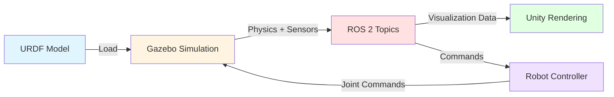

# Digital Twin Workflows

## Introduction

You've learned about physics simulation and sensor models. Now let's put it all together: creating **Digital Twins** for humanoid robot development. A Digital Twin is a virtual replica that behaves like the real robot, enabling you to test algorithms safely before hardware deployment.

This section covers:
- Loading URDF models into Gazebo simulation
- Connecting Unity for high-fidelity visualization
- Testing walking gaits virtually
- Validating manipulation algorithms
- Sim-to-real transfer strategies

## The Digital Twin Pipeline

A complete Digital Twin workflow involves three key stages:



**Flow**:
1. **URDF Model**: Defines robot structure (Module 1)
2. **Gazebo Simulation**: Computes physics and sensor data
3. **ROS 2 Topics**: Transmits data between components
4. **Unity Rendering** (optional): Visualizes in high fidelity
5. **Robot Controller**: Your algorithms (walking, grasping, navigation)

## Loading URDF into Gazebo

### Step 1: Prepare Your URDF

Ensure your URDF includes:
- Accurate masses and inertias for all links
- Collision geometries for physics
- Joint limits and dynamics
- Gazebo-specific sensor plugins (LiDAR, cameras, IMU)

Example URDF snippet with Gazebo extensions:

```xml
<?xml version="1.0"?>
<robot name="humanoid_robot">
  <!-- Links and joints from Module 1 -->
  <link name="torso">
    <inertial>
      <mass value="10.0"/>
      <inertia ixx="0.5" iyy="0.5" izz="0.2" ixy="0" ixz="0" iyz="0"/>
    </inertial>
    <visual>
      <geometry>
        <mesh filename="package://my_robot/meshes/torso.stl"/>
      </geometry>
    </visual>
    <collision>
      <geometry>
        <box size="0.3 0.2 0.5"/>
      </geometry>
    </collision>
  </link>

  <!-- Gazebo-specific material and friction -->
  <gazebo reference="torso">
    <material>Gazebo/Blue</material>
    <mu1>0.2</mu1>
    <mu2>0.2</mu2>
  </gazebo>

  <!-- IMU sensor plugin -->
  <gazebo reference="torso">
    <sensor name="torso_imu" type="imu">
      <update_rate>100</update_rate>
      <plugin name="gazebo_ros_imu" filename="libgazebo_ros_imu_sensor.so">
        <ros>
          <namespace>/humanoid</namespace>
          <remapping>~/out:=imu/data</remapping>
        </ros>
      </plugin>
    </sensor>
  </gazebo>
</robot>
```

### Step 2: Create a Launch File

ROS 2 launch files orchestrate Gazebo startup:

```python
# launch/gazebo_humanoid.launch.py
from launch import LaunchDescription
from launch.actions import IncludeLaunchDescription
from launch_ros.actions import Node
from launch.launch_description_sources import PythonLaunchDescriptionSource
from ament_index_python.packages import get_package_share_directory
import os

def generate_launch_description():
    # Path to your URDF file
    urdf_file = os.path.join(
        get_package_share_directory('my_robot_description'),
        'urdf',
        'humanoid.urdf'
    )

    with open(urdf_file, 'r') as infp:
        robot_desc = infp.read()

    # Start Gazebo
    gazebo = IncludeLaunchDescription(
        PythonLaunchDescriptionSource([
            os.path.join(get_package_share_directory('gazebo_ros'),
                         'launch', 'gazebo.launch.py')
        ]),
        launch_arguments={'verbose': 'true'}.items()
    )

    # Spawn robot in Gazebo
    spawn_entity = Node(
        package='gazebo_ros',
        executable='spawn_entity.py',
        arguments=['-topic', 'robot_description', '-entity', 'humanoid'],
        output='screen'
    )

    # Publish robot description
    robot_state_publisher = Node(
        package='robot_state_publisher',
        executable='robot_state_publisher',
        output='screen',
        parameters=[{'robot_description': robot_desc}]
    )

    return LaunchDescription([
        gazebo,
        robot_state_publisher,
        spawn_entity,
    ])
```

### Step 3: Launch Simulation

```bash
ros2 launch my_robot_description gazebo_humanoid.launch.py
```

You should see:
- Gazebo window opens with your humanoid robot
- Robot spawned at origin (0, 0, 0)
- Sensors publishing to ROS topics (check with `ros2 topic list`)

## Connecting Unity for Visualization

Unity provides photorealistic rendering that Gazebo can't match. The workflow:

```
Gazebo (Physics) → ROS 2 Topics → Unity (Visuals)
```

### Step 1: Install Unity Robotics Hub

1. Download Unity Hub and Unity Editor (2020.3+ LTS)
2. Install Unity Robotics Hub packages:
   - `com.unity.robotics.ros-tcp-connector`
   - `com.unity.robotics.urdf-importer`

### Step 2: Import URDF into Unity

Unity's URDF Importer reads your robot description:

```
Assets → Import Robot from URDF
  → Select your humanoid.urdf file
  → Unity creates GameObjects matching URDF structure
```

Unity converts:
- URDF links → Unity GameObjects
- URDF joints → Unity ArticulationBody components
- Visual meshes → 3D models with materials

### Step 3: Connect to ROS 2

Configure ROS TCP Connector:

```csharp
// Unity C# script
using Unity.Robotics.ROSTCPConnector;

public class ROSConnection : MonoBehaviour
{
    void Start()
    {
        ROSConnection.GetOrCreateInstance().ConnectOnStart = true;
        ROSConnection.GetOrCreateInstance().ROSIPAddress = "127.0.0.1";
        ROSConnection.GetOrCreateInstance().ROSPort = 10000;
    }
}
```

Start ROS TCP Endpoint:

```bash
ros2 run ros_tcp_endpoint default_server_endpoint --ros-args -p ROS_IP:=0.0.0.0
```

### Step 4: Subscribe to Joint States

Unity updates robot pose based on `/joint_states`:

```csharp
using RosMessageTypes.Sensor;

public class JointStateSubscriber : MonoBehaviour
{
    void Start()
    {
        ROSConnection.GetOrCreateInstance().Subscribe<JointStateMsg>(
            "/joint_states",
            UpdateJointPositions
        );
    }

    void UpdateJointPositions(JointStateMsg msg)
    {
        for (int i = 0; i < msg.name.Length; i++)
        {
            string jointName = msg.name[i];
            float position = (float)msg.position[i];

            // Find Unity joint and update rotation
            ArticulationBody joint = FindJointByName(jointName);
            if (joint != null)
            {
                joint.SetDriveTarget(ArticulationDriveAxis.X, position * Mathf.Rad2Deg);
            }
        }
    }
}
```

Now Gazebo physics drives Unity visuals in real-time!

## Testing Walking Gaits in Simulation

### Workflow: Develop → Simulate → Validate → Deploy

#### 1. Develop Walking Controller

Write a gait planner in Python:

```python
import rclpy
from rclpy.node import Node
from sensor_msgs.msg import JointState
from std_msgs.msg import Float64MultiArray

class SimpleGaitController(Node):
    def __init__(self):
        super().__init__('gait_controller')

        # Subscribe to IMU for balance feedback
        self.imu_sub = self.create_subscription(
            Imu, '/humanoid/imu/data', self.imu_callback, 10
        )

        # Publish joint commands
        self.joint_pub = self.create_publisher(
            Float64MultiArray, '/humanoid/joint_commands', 10
        )

        # Simple walking state machine
        self.create_timer(0.01, self.control_loop)  # 100 Hz

    def control_loop(self):
        # Compute desired joint positions for current gait phase
        joint_commands = self.compute_gait_phase()
        self.joint_pub.publish(joint_commands)

    def imu_callback(self, msg):
        # Adjust gait based on body tilt
        self.current_tilt = msg.orientation
```

#### 2. Test in Gazebo

```bash
# Terminal 1: Start simulation
ros2 launch my_robot_description gazebo_humanoid.launch.py

# Terminal 2: Run gait controller
ros2 run my_robot_control simple_gait_controller

# Terminal 3: Monitor robot state
ros2 topic echo /humanoid/imu/data
ros2 topic echo /joint_states
```

#### 3. Iterate Based on Results

**Common issues and fixes**:

| Problem | Cause | Fix |
|---------|-------|-----|
| Robot falls forward | CoM too far ahead | Lean torso backward |
| Foot slips | Low friction | Increase μ in URDF `<mu>` |
| Unstable oscillation | High gains | Reduce PID controller gains |
| Slow simulation | Too small timestep | Increase `max_step_size` |

#### 4. Validate Metrics

Measure performance:

```python
# Track success metrics
steps_taken = 0
distance_traveled = 0
falls = 0
average_speed = 0

# Log data for analysis
rosbag record /joint_states /imu/data /odom
```

Analyze rosbag data to tune parameters before hardware deployment.

## Testing Manipulation in Simulation

### Use Case: Grasp Object on Table

#### 1. Set Up Scene

Add objects to Gazebo world:

```xml
<world name="default">
  <!-- Table -->
  <model name="table">
    <static>true</static>
    <link name="link">
      <pose>1.0 0 0.5 0 0 0</pose>
      <collision>
        <geometry>
          <box size="1.0 0.6 1.0"/></geometry>
      </collision>
      <visual>
        <geometry>
          <box size="1.0 0.6 1.0"/>
        </geometry>
      </visual>
    </link>
  </model>

  <!-- Cup to grasp -->
  <model name="cup">
    <pose>1.0 0 1.05 0 0 0</pose>
    <link name="link">
      <inertial>
        <mass>0.2</mass>
      </inertial>
      <collision>
        <geometry>
          <cylinder radius="0.04" length="0.1"/>
        </geometry>
      </collision>
    </link>
  </model>
</world>
```

#### 2. Plan Grasp

Use depth camera to detect cup:

```python
# Depth camera gives 3D position of cup
cup_position = detect_object_from_depth_camera()

# Compute inverse kinematics to reach cup
joint_angles = compute_ik(cup_position)

# Move arm to pre-grasp pose
move_arm(joint_angles)

# Close gripper
close_gripper(force=10.0)  # Newtons
```

#### 3. Test in Simulation

Validate:
- ✅ Arm reaches cup without self-collision
- ✅ Gripper applies enough force (check contact forces)
- ✅ Cup doesn't slip when lifted
- ✅ Robot maintains balance during reach

#### 4. Iterate

Adjust:
- Grasp points if cup slips
- Gripper force if crushing object
- Arm trajectory if collisions occur

## Sim-to-Real Transfer

### The Reality Gap

Simulation != Reality due to:

1. **Physics Approximations**
   - Contact dynamics simplified
   - Friction models don't capture all surface variations
   - Motor models ignore heating, backlash, compliance

2. **Sensor Differences**
   - Real sensors have systematic biases
   - Noise models in simulation are idealized
   - Real cameras have lens distortion, motion blur

3. **Unmodeled Dynamics**
   - Cable drag on robot
   - Air resistance for fast motions
   - Temperature effects on motors

### Strategies to Bridge the Gap

#### 1. Domain Randomization

Vary simulation parameters during training:

```python
# Randomize friction each episode
friction = random.uniform(0.5, 1.5)

# Randomize object masses
object_mass = random.uniform(0.1, 0.5)

# Randomize sensor noise
imu_noise_stddev = random.uniform(0.001, 0.01)
```

This makes algorithms robust to real-world variations.

#### 2. Accurate Parameter Identification

Measure real robot parameters:
- Weigh each link
- Measure joint friction (move joint at constant velocity, measure torque)
- Calibrate sensor noise (collect data, compute statistics)

Update URDF to match reality.

#### 3. Hybrid Simulation-Reality Testing

1. **Coarse tuning in simulation** (80% of development)
2. **Fine tuning on hardware** (20% of development)
3. **Update simulation** based on hardware results
4. **Iterate**

#### 4. System Identification

Run experiments on real robot to identify unknown parameters:

```python
# Apply known torque, measure resulting motion
apply_torque(joint='left_elbow', torque=5.0)
measured_acceleration = read_joint_encoder()

# Fit model to data
estimated_inertia = fit_dynamic_model(torque, acceleration)

# Update URDF
update_urdf_inertia('left_forearm', estimated_inertia)
```

## Best Practices for Digital Twin Development

### 1. Start Simple, Add Complexity

Begin with:
- Simple environment (flat floor, no obstacles)
- Perfect sensors (no noise)
- Basic controller

Then incrementally add:
- Uneven terrain
- Realistic sensor noise
- Disturbances (pushes, unexpected obstacles)

### 2. Validate Incrementally

Test each component separately:
- ✅ Physics: Does robot stand under gravity correctly?
- ✅ Sensors: Do readings match expected values?
- ✅ Controller: Do joints move as commanded?
- ✅ Integration: Does full system behave as expected?

### 3. Log Everything

Record data for offline analysis:

```bash
ros2 bag record -a  # Record all topics
```

Analyze to find:
- When did the robot become unstable?
- What sensor readings preceded the fall?
- Are commanded vs actual joint positions matching?

### 4. Use Visualization Tools

- **RViz**: Visualize sensor data, TF frames, point clouds
- **PlotJuggler**: Plot time-series data from rosbags
- **Gazebo GUI**: Monitor contact forces, joint torques in real-time

## Summary

Digital Twin workflows enable safe, efficient humanoid robot development:

**Pipeline**:
1. **URDF Model** → Defines robot structure
2. **Gazebo Simulation** → Computes physics and sensors
3. **ROS 2 Topics** → Transmits data
4. **Unity (optional)** → High-fidelity visualization
5. **Controllers** → Your algorithms

**Development Cycle**:
- Develop algorithms in simulation
- Test with realistic physics and sensors
- Iterate rapidly (no hardware damage risk)
- Validate on real hardware
- Update simulation based on real data

**Key Strategies**:
- Domain randomization for robustness
- Accurate parameter identification
- Incremental validation
- Extensive logging and analysis

With a well-calibrated Digital Twin, you can develop 80% of your robot's capabilities before touching hardware—saving time, money, and robots!

---

**Next Steps**: Ready for advanced perception? Continue to [Module 3: AI-Driven Perception (NVIDIA Isaac)](../module-3-isaac/index.md) for photorealistic simulation and synthetic data generation.

## References

Open Robotics. (2024). *Gazebo Documentation: Spawning Models*. https://gazebosim.org/api/gazebo/7/spawn_model.html

Unity Technologies. (2024). *Unity Robotics Hub: URDF Importer*. https://github.com/Unity-Technologies/URDF-Importer

Open Robotics. (2024). *ROS 2 Documentation: Launch Files*. https://docs.ros.org/en/humble/Tutorials/Intermediate/Launch/Launch-Main.html
