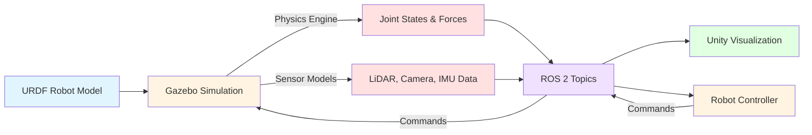

# Module 2: Simulation & Digital Twins

## Introduction

Imagine testing a humanoid walking algorithm on real hardware—then watching your expensive robot topple over because you miscalculated the center of mass. Or deploying a vision system that fails because you didn't test it in diverse lighting conditions. Real-world testing is costly, time-consuming, and potentially dangerous.

**Simulation** solves this problem by creating virtual environments where you can test, iterate, and validate robot behaviors before touching physical hardware. This module introduces **Digital Twins**—virtual replicas of robots that enable safe, efficient development.

## What You'll Learn

Building on Module 1's ROS 2 fundamentals, this module explores:

- **Physics Simulation**: How gravity, inertia, friction, and collisions affect humanoid robot behavior
- **Sensor Modeling**: Simulating LiDAR, depth cameras, IMUs, and RGB cameras for perception testing
- **Gazebo Integration**: Loading URDF models into physics-based simulation environments
- **Unity Visualization**: High-fidelity 3D rendering for photorealistic testing
- **Digital Twin Workflows**: Testing complex behaviors (walking, grasping, navigation) before deployment

## Why Simulation for Humanoid Robotics?

Humanoid robots present unique challenges that make simulation essential:

### 1. Safety and Cost
- **Prevent hardware damage**: Test unstable walking gaits virtually before risking falls
- **Iterate rapidly**: Make algorithm changes in seconds, not hours of hardware setup
- **Reduce costs**: No need for multiple physical robots or expensive sensor arrays

### 2. Repeatability
- **Deterministic testing**: Run the same scenario hundreds of times with identical initial conditions
- **Edge case exploration**: Test rare scenarios (slippery floors, sensor failures) without physical risk
- **Regression testing**: Verify that new code doesn't break existing behaviors

### 3. Scalability
- **Parallel testing**: Run multiple simulations simultaneously on cloud infrastructure
- **Diverse environments**: Test in factories, homes, outdoor terrains without physical setup
- **Sensor variations**: Swap cameras, add LiDAR, change IMU noise models instantly

### 4. Data Generation
- **Synthetic training data**: Generate thousands of labeled images for vision algorithms
- **Domain randomization**: Vary lighting, textures, object positions for robust learning
- **Ground truth**: Know exact robot pose, object locations, forces—impossible with real sensors

## The Digital Twin Concept

A **Digital Twin** is a virtual replica of a physical system that:

1. **Mirrors structure**: Uses the same URDF description as the real robot
2. **Simulates physics**: Models gravity, collisions, joint dynamics, sensor noise
3. **Receives commands**: Accepts the same ROS 2 messages as real hardware
4. **Provides feedback**: Publishes sensor data matching real-world formats

### Digital Twin Workflow

```
Develop Algorithm → Test in Simulation → Validate Behavior → Deploy to Real Robot
       ↑                                                              ↓
       └───────────────── Iterate if issues found ──────────────────┘
```

**Key Principle**: Code written for the Digital Twin should work on the real robot with minimal changes (only hardware interface differences).

## Simulation Tools Overview

### Gazebo: Physics-Based Simulation

**Gazebo** is the industry-standard robotics simulator with:

- **Physics engines**: ODE, Bullet, Simbody, DART for realistic dynamics
- **Sensor models**: Cameras, LiDAR, IMU, force/torque, contact sensors
- **ROS 2 integration**: Publishes/subscribes to standard ROS topics
- **Plugin system**: Extend functionality with custom C++ plugins
- **SDF format**: Enhanced URDF for simulation-specific features

**Use Gazebo for**:
- Physics validation (will the robot balance?)
- Sensor testing (does the LiDAR detect obstacles?)
- Control algorithm development (can it walk up stairs?)

### Unity: High-Fidelity Visualization

**Unity** is a game engine adapted for robotics with:

- **Photorealistic rendering**: Advanced lighting, shadows, reflections
- **Unity Robotics Hub**: ROS 2 integration packages
- **Asset library**: Pre-built 3D models, environments, materials
- **Real-time visualization**: Monitor robot behavior in visually rich environments
- **AR/VR support**: Test human-robot interaction in immersive settings

**Use Unity for**:
- Vision algorithm development (realistic camera images)
- Human-robot interaction studies (social robotics)
- Marketing and demonstrations (beautiful visualizations)
- Sensor fusion testing (multiple camera angles)

### Gazebo + Unity: Best of Both Worlds

Combine them for comprehensive testing:



**How it works:**
- **Gazebo**: Computes physics, joint states, sensor readings
- **ROS 2**: Transmits data between systems
- **Unity**: Visualizes results in high fidelity
- **Controller**: Your algorithms make decisions based on sensor data

This separation lets you leverage Gazebo's physics while enjoying Unity's visuals.

## Module Structure

### 1. [Physics Principles](./physics-principles.md)
Understand the physics that make humanoid simulation challenging:
- Gravity and balance for bipedal walking
- Inertia and momentum in dynamic movements
- Friction models for foot-ground contact
- Collision detection for safe manipulation

### 2. [Sensor Simulation](./sensors.md)
Learn how to model robot perception:
- **LiDAR**: Laser range finding for obstacle detection and mapping
- **Depth Cameras**: RGB-D data for 3D scene understanding
- **IMU**: Accelerometer and gyroscope for balance and orientation
- **RGB Cameras**: Visual perception for object recognition

Each sensor type includes:
- Physical principles and data formats
- Simulation models and noise characteristics
- Use cases for humanoid robotics
- Configuration examples

### 3. [Digital Twin Workflows](./digital-twin.md)
Apply simulation to real development scenarios:
- Loading URDF models into Gazebo
- Connecting Unity for visualization
- Testing walking gaits before hardware deployment
- Validating grasping algorithms in simulation
- Sim-to-real transfer considerations

## Prerequisites

Before starting this module, you should understand:

- **ROS 2 Fundamentals** (Module 1): Nodes, topics, services, actions
- **URDF Modeling** (Module 1): Robot description format
- **Basic Physics**: Concepts of mass, force, acceleration (high school level)

No prior Gazebo or Unity experience required—we'll build from the ground up!

## What Simulation Cannot Replace

While powerful, simulation has limitations:

### Reality Gap (Sim-to-Real Transfer)
- **Physics approximations**: Simulators simplify contact dynamics, friction, air resistance
- **Sensor noise**: Real sensors have complex failure modes not easily modeled
- **Unmodeled phenomena**: Cable drag, motor heating, surface irregularities

### Computational Constraints
- **Real-time requirements**: Complex physics may run slower than real-time
- **Accuracy vs speed tradeoff**: Higher fidelity = slower simulation

### Domain-Specific Challenges
- **Soft objects**: Cloth, rubber, fluids are computationally expensive
- **Human interaction**: Unpredictable human behavior difficult to model
- **Environmental complexity**: Real-world clutter, lighting variations, acoustic properties

**Best Practice**: Use simulation for 80% of development, then validate on real hardware for the final 20%.

## Learning Path

This module builds progressively:

1. **Physics Principles**: Understand what the simulator computes
2. **Sensor Models**: Learn how virtual sensors mimic real perception
3. **Digital Twin Workflows**: Apply simulation to development pipelines

By the end, you'll be able to:
- Create realistic humanoid simulations in Gazebo
- Choose appropriate sensors for perception tasks
- Test behaviors virtually before hardware deployment
- Understand sim-to-real transfer challenges

## What's Next?

After mastering simulation, you'll be ready for:

- **Module 3**: Advanced perception with NVIDIA Isaac Sim (photorealistic rendering, synthetic data)
- **Module 4**: Vision-Language-Action systems tested in simulation

Simulation is where algorithms mature before touching real hardware. Let's begin by understanding the physics that makes humanoid simulation unique!

---

**Ready to start?** Continue to [Physics Principles](./physics-principles.md) to learn how gravity, inertia, and collisions affect humanoid robots.

## References

Open Robotics. (2024). *Gazebo Documentation*. https://gazebosim.org/docs

Unity Technologies. (2024). *Unity Robotics Hub*. https://github.com/Unity-Technologies/Unity-Robotics-Hub
