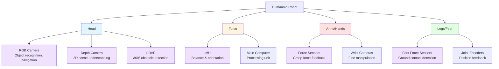

# Sensor Simulation for Humanoid Robots

## Introduction

Sensors are a robot's eyes, ears, and sense of balance. They provide the perception data that enables navigation, manipulation, and interaction with the environment. Simulating sensors accurately is crucial for developing robust perception algorithms before deploying to real hardware.

This section covers four essential sensor types for humanoid robotics:

1. **LiDAR**: Laser range finding for obstacle detection and mapping
2. **Depth Cameras**: RGB-D data for 3D scene understanding
3. **IMU**: Accelerometer and gyroscope for balance and orientation
4. **RGB Cameras**: Visual perception for object recognition

For each sensor, we'll explore:
- Physical principles and how they work
- Simulation models in Gazebo
- Data formats and ROS 2 message types
- Use cases for humanoid robotics
- Configuration examples

## LiDAR: Laser Range Finding

### How LiDAR Works

**LiDAR (Light Detection and Ranging)** emits laser pulses and measures the time for reflections to return:

```
Distance = (c * Δt) / 2
```

Where:
- `c` = speed of light (3 × 10⁸ m/s)
- `Δt` = round-trip time
- Divide by 2 because light travels to object and back

**Scanning Pattern**:
- **2D LiDAR**: Single horizontal plane scan (e.g., 270° field of view, 0.25° resolution)
- **3D LiDAR**: Multiple scanning planes (e.g., 64 vertical beams, 360° horizontal)

### LiDAR Data Format

LiDAR data is published as `sensor_msgs/LaserScan` (2D) or `sensor_msgs/PointCloud2` (3D):

```python
# sensor_msgs/LaserScan
angle_min: -2.35619  # Start angle (radians)
angle_max: 2.35619   # End angle (radians)
angle_increment: 0.004363  # Angular resolution
range_min: 0.1       # Minimum valid range (m)
range_max: 30.0      # Maximum valid range (m)
ranges: [1.5, 1.52, 1.48, ...]  # Distance measurements (m)
```

### LiDAR in Gazebo Simulation

Configuration example for a 2D LiDAR on humanoid's head:

```xml
<gazebo reference="head">
  <sensor type="ray" name="head_lidar">
    <pose>0 0 0.15 0 0 0</pose>  <!-- 15cm above head link origin -->
    <visualize>true</visualize>
    <update_rate>10</update_rate>
    <ray>
      <scan>
        <horizontal>
          <samples>720</samples>         <!-- 720 measurements -->
          <resolution>1</resolution>
          <min_angle>-2.356</min_angle>  <!-- -135 degrees -->
          <max_angle>2.356</max_angle>   <!-- +135 degrees -->
        </horizontal>
      </scan>
      <range>
        <min>0.10</min>  <!-- 10cm minimum range -->
        <max>30.0</max>  <!-- 30m maximum range -->
        <resolution>0.01</resolution>
      </range>
      <noise>
        <type>gaussian</type>
        <mean>0.0</mean>
        <stddev>0.01</stddev>  <!-- 1cm noise -->
      </noise>
    </ray>
    <plugin name="gazebo_ros_laser" filename="libgazebo_ros_ray_sensor.so">
      <ros>
        <namespace>/humanoid</namespace>
        <remapping>~/out:=scan</remapping>
      </ros>
      <output_type>sensor_msgs/LaserScan</output_type>
    </plugin>
  </sensor>
</gazebo>
```

### Use Cases for Humanoid Robotics

✅ **Obstacle Detection**
- Scan environment for walls, furniture, people
- Maintain safe distance while walking
- Detect sudden obstacles (doors opening, people moving)

✅ **Mapping and Localization**
- Build 2D floor plans (SLAM - Simultaneous Localization and Mapping)
- Localize robot within known maps
- Navigate autonomously through environments

✅ **Collision Avoidance**
- Real-time obstacle detection during navigation
- Emergency stop if obstacle detected in path
- Safe navigation in crowded spaces

❌ **Not Ideal For**:
- **Fine manipulation**: LiDAR provides distance only, not object geometry details
- **Overhead obstacles**: 2D LiDAR misses hanging objects unless 3D
- **Transparent/reflective surfaces**: Glass, mirrors can produce incorrect readings

### LiDAR Advantages vs Limitations

| Advantages | Limitations |
|------------|-------------|
| ✅ Accurate distance measurements | ❌ No color/texture information |
| ✅ Works in varying lighting (even dark) | ❌ Struggles with reflective surfaces |
| ✅ Long range (up to 100m for some models) | ❌ Expensive hardware (real sensors) |
| ✅ High update rates (10-40 Hz) | ❌ Single point per ray (no object detail) |

## Depth Cameras: RGB-D Perception

### How Depth Cameras Work

Depth cameras provide both **RGB color images** and **depth information** (distance to each pixel). Common technologies:

1. **Structured Light** (e.g., Intel RealSense D435): Projects infrared pattern, measures distortion
2. **Time-of-Flight** (e.g., Microsoft Kinect v2): Measures infrared light travel time
3. **Stereo Vision** (e.g., ZED camera): Computes depth from two camera views

### Depth Camera Data Format

Depth cameras publish two synchronized topics:

```python
# RGB Image: sensor_msgs/Image
height: 480
width: 640
encoding: "rgb8"
data: [pixel values...]

# Depth Image: sensor_msgs/Image
height: 480
width: 640
encoding: "32FC1"  # 32-bit float depth values
data: [distance in meters per pixel...]
```

Often combined into `sensor_msgs/PointCloud2` for 3D point clouds.

### Depth Camera in Gazebo Simulation

Configuration example for a depth camera in humanoid's head:

```xml
<gazebo reference="head">
  <sensor type="depth" name="head_depth_camera">
    <update_rate>30</update_rate>
    <camera>
      <horizontal_fov>1.047</horizontal_fov>  <!-- 60 degrees -->
      <image>
        <width>640</width>
        <height>480</height>
        <format>R8G8B8</format>
      </image>
      <clip>
        <near>0.05</near>  <!-- 5cm minimum depth -->
        <far>10.0</far>    <!-- 10m maximum depth -->
      </clip>
    </camera>
    <plugin name="depth_camera_plugin" filename="libgazebo_ros_camera.so">
      <ros>
        <namespace>/humanoid/depth_camera</namespace>
        <remapping>color/image_raw:=rgb/image_raw</remapping>
        <remapping>depth/image_raw:=depth/image_raw</remapping>
        <remapping>depth/points:=depth/points</remapping>
      </ros>
    </plugin>
  </sensor>
</gazebo>
```

### Use Cases for Humanoid Robotics

✅ **3D Object Recognition**
- Identify objects by shape and color
- Estimate object pose (position and orientation)
- Distinguish between similar-looking objects using depth

✅ **Manipulation Planning**
- Measure distance to grasp targets
- Detect table surfaces and object heights
- Plan collision-free arm trajectories

✅ **Human-Robot Interaction**
- Detect people and track their movements
- Gesture recognition (waving, pointing)
- Maintain safe distance from humans

✅ **Scene Understanding**
- Segment scene into objects, walls, floor
- Detect stairs, ramps, and elevation changes
- Build 3D maps of indoor environments

❌ **Not Ideal For**:
- **Outdoor use**: Sunlight interferes with infrared patterns
- **Long range**: Most depth cameras limited to 5-10m
- **Fast motion**: Motion blur affects depth accuracy

### Depth Camera Advantages vs Limitations

| Advantages | Limitations |
|------------|-------------|
| ✅ Dense 3D data (millions of points) | ❌ Limited outdoor performance |
| ✅ Color + depth in single sensor | ❌ Sensitive to lighting conditions |
| ✅ Relatively affordable | ❌ Limited range (typically < 10m) |
| ✅ Good for manipulation tasks | ❌ Struggles with black/reflective surfaces |

## IMU: Inertial Measurement Unit

### How IMUs Work

An **IMU** combines:

1. **Accelerometer**: Measures linear acceleration (m/s²) in 3 axes (x, y, z)
2. **Gyroscope**: Measures angular velocity (rad/s) around 3 axes (roll, pitch, yaw)
3. **Magnetometer** (optional): Measures magnetic field for absolute heading

**Key Insight**: IMU measures **forces and rotations**, not position directly.

### IMU Data Format

IMU data is published as `sensor_msgs/Imu`:

```python
# sensor_msgs/Imu
orientation: [x, y, z, w]  # Quaternion (often from sensor fusion)
angular_velocity: [x, y, z]  # rad/s (gyroscope)
linear_acceleration: [x, y, z]  # m/s² (accelerometer)

# Covariance matrices (measurement uncertainty)
orientation_covariance: [...]
angular_velocity_covariance: [...]
linear_acceleration_covariance: [...]
```

### IMU in Gazebo Simulation

Configuration example for IMU in humanoid's torso:

```xml
<gazebo reference="torso">
  <sensor name="torso_imu" type="imu">
    <update_rate>100</update_rate>  <!-- 100 Hz for fast response -->
    <imu>
      <angular_velocity>
        <x>
          <noise type="gaussian">
            <mean>0.0</mean>
            <stddev>0.0001</stddev>  <!-- Gyro noise -->
          </noise>
        </x>
        <y>
          <noise type="gaussian">
            <mean>0.0</mean>
            <stddev>0.0001</stddev>
          </noise>
        </y>
        <z>
          <noise type="gaussian">
            <mean>0.0</mean>
            <stddev>0.0001</stddev>
          </noise>
        </z>
      </angular_velocity>
      <linear_acceleration>
        <x>
          <noise type="gaussian">
            <mean>0.0</mean>
            <stddev>0.01</stddev>  <!-- Accelerometer noise -->
          </noise>
        </x>
        <y>
          <noise type="gaussian">
            <mean>0.0</mean>
            <stddev>0.01</stddev>
          </noise>
        </y>
        <z>
          <noise type="gaussian">
            <mean>0.0</mean>
            <stddev>0.01</stddev>
          </noise>
        </z>
      </linear_acceleration>
    </imu>
    <plugin name="gazebo_ros_imu" filename="libgazebo_ros_imu_sensor.so">
      <ros>
        <namespace>/humanoid</namespace>
        <remapping>~/out:=imu/data</remapping>
      </ros>
    </plugin>
  </sensor>
</gazebo>
```

### Use Cases for Humanoid Robotics

✅ **Balance Control**
- Detect when robot is tipping over (angular velocity change)
- Measure body tilt for balance corrections
- Fast feedback loop (100+ Hz) for stability

✅ **Fall Detection**
- Monitor sudden changes in acceleration
- Trigger protective responses (brace for impact, shut down motors)

✅ **State Estimation**
- Fuse IMU with joint encoders for body pose estimation
- Estimate velocity and orientation without external sensors
- Dead reckoning when GPS/cameras unavailable

✅ **Gait Stabilization**
- Measure ground impact during walking
- Adjust step timing based on acceleration feedback
- Detect uneven terrain from unexpected accelerations

❌ **Not Ideal For**:
- **Absolute positioning**: IMU drift accumulates over time (integrate twice to get position)
- **Slow motions**: Noise dominates at low angular velocities
- **Long-term orientation**: Gyro drift requires periodic correction from other sensors

### IMU Advantages vs Limitations

| Advantages | Limitations |
|------------|-------------|
| ✅ High update rates (100-1000 Hz) | ❌ Drifts over time (integration error) |
| ✅ Works in all lighting/weather | ❌ Cannot provide absolute position |
| ✅ Small, lightweight, cheap | ❌ Sensitive to vibrations |
| ✅ Essential for balance control | ❌ Requires sensor fusion for best results |

## RGB Cameras: Visual Perception

### How RGB Cameras Work

Standard cameras capture 2D images with color information (Red, Green, Blue channels). Unlike depth cameras, they don't provide distance information directly—just pixel colors.

### RGB Camera Data Format

RGB cameras publish `sensor_msgs/Image`:

```python
# sensor_msgs/Image
height: 480
width: 640
encoding: "bgr8"  # or "rgb8", "mono8", etc.
step: 1920  # Row length in bytes
data: [pixel values in specified encoding...]
```

Often accompanied by `sensor_msgs/CameraInfo` with intrinsic parameters (focal length, distortion).

### RGB Camera in Gazebo Simulation

Configuration example for RGB camera in humanoid's head:

```xml
<gazebo reference="head">
  <sensor type="camera" name="head_camera">
    <update_rate>30.0</update_rate>
    <camera name="head_camera">
      <horizontal_fov>1.3962634</horizontal_fov>  <!-- 80 degrees -->
      <image>
        <width>1920</width>
        <height>1080</height>
        <format>R8G8B8</format>
      </image>
      <clip>
        <near>0.02</near>
        <far>300</far>
      </clip>
      <noise>
        <type>gaussian</type>
        <mean>0.0</mean>
        <stddev>0.007</stddev>
      </noise>
    </camera>
    <plugin name="camera_controller" filename="libgazebo_ros_camera.so">
      <ros>
        <namespace>/humanoid/camera</namespace>
        <remapping>image_raw:=rgb/image_raw</remapping>
        <remapping>camera_info:=rgb/camera_info</remapping>
      </ros>
    </plugin>
  </sensor>
</gazebo>
```

### Use Cases for Humanoid Robotics

✅ **Object Recognition**
- Identify objects by appearance (color, texture, shape)
- Classify objects with deep learning models
- Read text, QR codes, signs

✅ **Visual Servoing**
- Track objects and adjust robot motion to follow
- Align hand with grasp target using visual feedback
- Fine-grained manipulation guided by camera

✅ **Human Interaction**
- Detect faces and recognize people
- Estimate human poses and gestures
- Maintain eye contact during conversation

✅ **Environment Understanding**
- Recognize rooms, furniture, landmarks
- Detect traffic signs, doors, obstacles
- Understand scene context (kitchen, office, outdoors)

❌ **Not Ideal For**:
- **Depth perception**: Single camera cannot measure distance (need stereo or depth camera)
- **Dark environments**: Requires adequate lighting
- **High-speed motion**: Motion blur degrades image quality

### RGB Camera Advantages vs Limitations

| Advantages | Limitations |
|------------|-------------|
| ✅ Rich visual information (color, texture) | ❌ No depth information (2D only) |
| ✅ High resolution (megapixels) | ❌ Lighting-dependent |
| ✅ Cheap, widely available | ❌ Computationally expensive to process |
| ✅ Many pre-trained AI models | ❌ Privacy concerns (recording people) |

## Sensor Placement on Humanoid Robots

Different sensors serve different purposes and are placed strategically on the humanoid:



**Sensor Locations Explained:**
- **Head**: Primary perception sensors (cameras, LiDAR) for navigation and object recognition
- **Torso**: IMU for balance control (close to center of mass)
- **Arms/Hands**: Force sensors and cameras for manipulation tasks
- **Legs/Feet**: Force sensors for walking, joint encoders for position feedback

## Choosing the Right Sensor

### Decision Matrix

| Task | Best Sensor | Why |
|------|-------------|-----|
| **Obstacle avoidance (navigation)** | LiDAR | Fast, accurate distance, 360° coverage |
| **Object grasping** | Depth Camera | 3D shape + color, close range |
| **Balance control** | IMU | High frequency, measures orientation directly |
| **Object recognition** | RGB Camera | Color/texture for classification |
| **Mapping indoors** | LiDAR or Depth Camera | Geometric data for map building |
| **Human detection** | RGB or Depth Camera | Visual features for person detection |
| **Stair detection** | Depth Camera | 3D data reveals elevation changes |
| **Fall detection** | IMU | Fast response to sudden accelerations |

### Sensor Fusion

Combining multiple sensors provides richer information than any single sensor:

**LiDAR + Depth Camera**:
- LiDAR: Long-range obstacle detection
- Depth Camera: Close-range object manipulation

**IMU + Camera**:
- IMU: Fast orientation updates
- Camera: Drift correction via visual landmarks

**RGB + Depth Camera**:
- RGB: Object recognition by appearance
- Depth: Object localization in 3D space

## Summary

This module covered four essential sensors for humanoid robotics:

1. **LiDAR**: Laser-based distance measurement for obstacle detection and mapping (2D/3D scans, long range)
2. **Depth Cameras**: RGB-D data combining color and depth for manipulation and scene understanding (dense 3D data)
3. **IMU**: Accelerometer + gyroscope for balance control and state estimation (high frequency, essential for bipedal stability)
4. **RGB Cameras**: Visual perception for object recognition and human interaction (rich appearance information)

**Key Takeaways**:
- Choose sensors based on task requirements (range, update rate, data type)
- Simulate realistic sensor noise to prepare for real-world deployment
- Combine multiple sensors (sensor fusion) for robust perception
- Configure Gazebo sensor models to match real hardware specifications

Next, we'll integrate these sensors into complete Digital Twin workflows for testing humanoid behaviors.

---

**Continue to**: [Digital Twin Workflows](./digital-twin.md)

## References

Open Robotics. (2024). *Gazebo Documentation: Sensors*. https://gazebosim.org/api/sensors/8/namespaceignition_1_1sensors.html

Open Robotics. (2024). *ROS 2 Documentation: sensor_msgs*. https://docs.ros2.org/latest/api/sensor_msgs/
