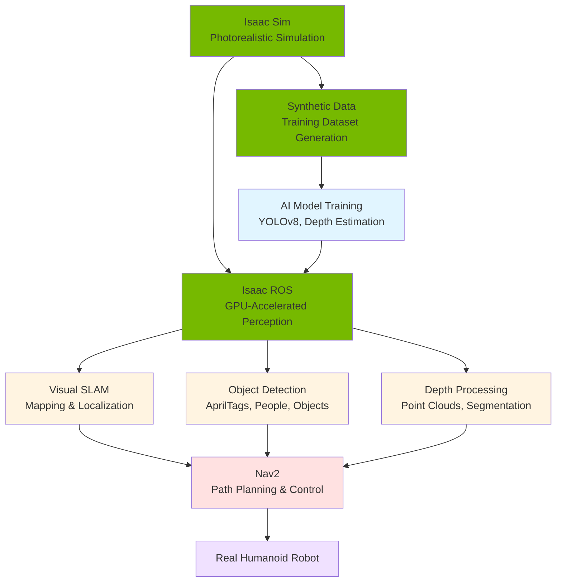

# Module 3: AI-Driven Perception with NVIDIA Isaac

## Introduction

You've mastered ROS 2 fundamentals and physics-based simulation with Gazebo. Now it's time to elevate your humanoid robotics capabilities with **NVIDIA Isaac**—a platform that brings photorealistic simulation, GPU-accelerated AI perception, and production-ready navigation to your robots.

While Gazebo provides excellent physics, NVIDIA Isaac adds:
- **Photorealistic rendering** with ray-traced lighting and shadows
- **High-fidelity sensor simulation** matching real camera and LiDAR behavior
- **GPU-accelerated perception** for real-time AI inference
- **Synthetic data generation** for training vision models at scale
- **Production-grade navigation** with Nav2 optimized for complex environments

This module bridges the gap between basic simulation and AI-powered autonomous systems.

## What You'll Learn

Building on Modules 1 and 2, this module explores:

- **Isaac Sim**: NVIDIA's photorealistic robot simulator powered by Omniverse
- **Isaac ROS**: GPU-accelerated perception packages for Visual SLAM and object detection
- **Visual SLAM**: Simultaneous Localization and Mapping for humanoid navigation
- **Nav2 Integration**: Path planning and obstacle avoidance for bipedal robots
- **Synthetic Data Generation**: Creating training datasets with domain randomization
- **Sim-to-Real Transfer**: Deploying AI models from simulation to real hardware

## Why NVIDIA Isaac for Humanoid Robotics?

### Beyond Traditional Simulation

Traditional simulators like Gazebo excel at physics, but modern AI robotics requires:

**Photorealistic Visuals**
- Train vision models on realistic synthetic images
- Test perception algorithms under varied lighting conditions
- Generate labeled datasets (bounding boxes, segmentation masks) automatically

**GPU Acceleration**
- Run multiple simulations in parallel on single GPU
- Accelerate ray tracing for realistic cameras and LiDAR
- Execute AI inference (object detection, SLAM) in real-time

**Production-Ready Tools**
- Isaac ROS packages integrate seamlessly with ROS 2
- Pre-trained AI models for common perception tasks
- Optimized for NVIDIA Jetson (embedded AI platform for robots)

### The NVIDIA Isaac Ecosystem



**Workflow:**
1. **Isaac Sim**: Create photorealistic environments and robot models
2. **Synthetic Data**: Generate labeled images for training
3. **AI Training**: Train perception models on synthetic data
4. **Isaac ROS**: Deploy trained models with GPU acceleration
5. **Visual SLAM**: Build maps and localize robot in real-time
6. **Nav2**: Plan paths and navigate autonomously
7. **Real Deployment**: Transfer to physical humanoid robot

## Module Structure

### 1. [Isaac Sim: Photorealistic Simulation](./isaac-sim.md)
Explore NVIDIA's flagship robot simulator:
- Omniverse USD: Universal Scene Description format
- Ray-traced rendering for realistic cameras
- Physically accurate sensor models (LiDAR, depth cameras)
- Multi-robot simulation on single GPU
- ROS 2 integration and workflow

### 2. [Visual SLAM for Humanoid Navigation](./vslam.md)
Master Simultaneous Localization and Mapping:
- Visual odometry: Tracking camera motion
- Feature extraction and matching (ORB, SIFT)
- Map building from camera observations
- Loop closure detection
- Isaac ROS Visual SLAM package
- Humanoid-specific challenges (camera shake, height changes)

### 3. [Nav2: Path Planning for Bipedal Robots](./nav2.md)
Navigate complex environments autonomously:
- Nav2 architecture and plugins
- Costmap generation from sensors
- Global path planning (A*, Dijkstra)
- Local trajectory control (DWA, TEB)
- Bipedal considerations (footstep planning, stability constraints)
- Recovery behaviors for humanoid robots

### 4. [Synthetic Data Generation](./synthetic-data.md)
Create AI training datasets at scale:
- Domain randomization techniques
- Lighting and texture variation
- Object placement strategies
- Automated labeling (bounding boxes, segmentation)
- Sim-to-real transfer best practices
- Training perception models on synthetic data

## Prerequisites

Before starting this module, you should understand:

- **ROS 2 Fundamentals** (Module 1): Nodes, topics, services, URDF
- **Simulation Basics** (Module 2): Physics, sensors, Gazebo workflows
- **Basic AI Concepts**: Neural networks, training vs inference, supervised learning
- **3D Math**: Transformations, quaternions, coordinate frames (helpful but not required)

**Hardware Recommendations**:
- NVIDIA GPU (GTX 1070+ or RTX series recommended)
- 16GB+ RAM
- Ubuntu 20.04 or 22.04

Isaac Sim can run on CPU, but GPU acceleration is highly recommended for realistic frame rates.

## Isaac vs Gazebo: When to Use Each

| Feature | Gazebo | Isaac Sim | Best For |
|---------|--------|-----------|----------|
| **Physics accuracy** | Good | Excellent | Gazebo: Quick prototyping<br/>Isaac: High-fidelity testing |
| **Visual realism** | Basic | Photorealistic | Gazebo: Algorithm dev<br/>Isaac: Vision AI training |
| **Sensor accuracy** | Approximated | Ray-traced | Gazebo: Basic testing<br/>Isaac: Sim-to-real deployment |
| **GPU acceleration** | Limited | Full | Gazebo: CPU-based workflows<br/>Isaac: Parallel simulations |
| **Ease of use** | Very easy | Moderate | Gazebo: Beginners<br/>Isaac: Production systems |
| **Community/docs** | Extensive | Growing | Gazebo: Mature ecosystem<br/>Isaac: Cutting-edge AI |

**Recommendation**:
- Use **Gazebo** for early development, controller tuning, and basic testing
- Use **Isaac Sim** when you need realistic sensors, AI training, or GPU acceleration
- Many teams use **both**: Gazebo for rapid iteration, Isaac Sim for final validation

## The Isaac ROS Advantage

Isaac ROS packages provide GPU-accelerated perception:

**Traditional ROS Perception**:
```
Camera → CPU Processing → 15-20 FPS → Results
```

**Isaac ROS Perception**:
```
Camera → GPU Processing → 60+ FPS → Results
```

**Key Packages**:
- `isaac_ros_visual_slam`: GPU-accelerated Visual SLAM
- `isaac_ros_apriltag`: High-speed fiducial marker detection
- `isaac_ros_dnn_inference`: Deep learning model inference
- `isaac_ros_image_proc`: GPU image processing (debayer, rectify, resize)

This speed enables real-time autonomy on resource-constrained platforms like NVIDIA Jetson.

## Real-World Applications

### Humanoid Navigation in Warehouses
- Visual SLAM maps the environment
- Nav2 plans collision-free paths around shelves
- Depth perception identifies obstacles (boxes, people, forklifts)
- Trained on synthetic warehouse scenes in Isaac Sim

**Deployment Example**: Amazon and other logistics companies are exploring humanoid robots for warehouse tasks. These robots use GPU-accelerated Visual SLAM to navigate dynamic environments with constantly moving inventory and personnel. Isaac Sim allows training on thousands of warehouse configurations without disrupting actual operations, generating diverse scenarios including peak hours, low-light conditions, and emergency situations.

### Home Service Robots
- Object detection finds target items (cups, tools, packages)
- Navigation to target locations using SLAM maps
- Manipulation guided by depth perception
- Tested in photorealistic home environments

**Deployment Example**: Home service humanoids must navigate cluttered, unstructured environments with variable lighting. Training in Isaac Sim enables testing across different home layouts, furniture arrangements, and lighting conditions—from bright daylight to dim evening ambiance. This synthetic training helps robots generalize to any home without requiring data collection in thousands of real houses.

### Human-Robot Interaction
- Person detection and tracking
- Social navigation (maintain comfortable distance)
- Gesture recognition for commands
- Trained on synthetic datasets with diverse human models

**Deployment Example**: Service robots in hospitals, hotels, and retail spaces must navigate around people safely and naturally. Isaac Sim's photorealistic human models enable training social navigation behaviors with diverse populations, testing personal space preferences, and validating safety protocols—all before deployment in real public spaces.

## Learning Path

This module progresses from simulation to AI-powered autonomy:

1. **Isaac Sim**: Understand photorealistic simulation and USD
2. **Visual SLAM**: Learn how robots build maps and localize
3. **Nav2**: Plan paths and navigate autonomously
4. **Synthetic Data**: Generate training datasets for AI models

By the end, you'll be able to:
- Create photorealistic simulation environments
- Deploy Visual SLAM for real-time localization
- Configure Nav2 for bipedal humanoid navigation
- Generate synthetic training data with domain randomization
- Transfer AI models from simulation to real robots

## What's Next?

After mastering AI-driven perception, you'll be ready for:

- **Module 4**: Vision-Language-Action systems combining perception with natural language understanding

Isaac brings AI and GPU acceleration to robotics. Let's begin by exploring Isaac Sim's photorealistic capabilities!

---

**Ready to start?** Continue to [Isaac Sim: Photorealistic Simulation](./isaac-sim.md) to learn about Omniverse and realistic sensor models.

## References

NVIDIA. (2024). *Isaac Sim Documentation*. https://docs.omniverse.nvidia.com/isaacsim/latest/

NVIDIA. (2024). *Isaac ROS Documentation*. https://nvidia-isaac-ros.github.io/
