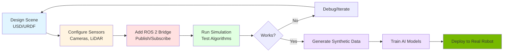

# Isaac Sim: Photorealistic Simulation

## Introduction

Isaac Sim is NVIDIA's flagship robot simulator, built on the Omniverse platform. It goes beyond traditional physics simulation to provide **photorealistic rendering**, **physically accurate sensors**, and **GPU-accelerated AI** for developing production-ready autonomous robots.

This section explores what makes Isaac Sim unique and how to leverage it for humanoid robotics development.

## What is Isaac Sim?

Isaac Sim is a robotics simulation application that provides:

- **Photorealistic rendering** with ray-traced lighting, shadows, and reflections
- **Physically accurate sensors** (cameras, LiDAR, depth sensors with real-world noise models)
- **USD scene format** (Universal Scene Description) for interoperability
- **ROS 2 integration** with native topic/service support
- **GPU acceleration** for running multiple simulations in parallel
- **Synthetic data generation** with automated labeling

**Built on NVIDIA Omniverse**: A platform for 3D collaboration and physically-based simulation.

## Omniverse USD: Universal Scene Description

### What is USD?

**USD (Universal Scene Description)** is an open-source format developed by Pixar for 3D content:

- **Hierarchical scene graphs**: Organize complex 3D worlds
- **Composition**: Combine multiple USD files (like LEGO blocks)
- **Layering**: Non-destructive edits and variants
- **Interchange format**: Import/export from Blender, Maya, Unreal Engine

### USD vs URDF

| Feature | URDF | USD |
|---------|------|-----|
| **Purpose** | Robot description | General 3D scenes |
| **Physics** | Basic (joints, links) | Advanced (fluids, cloth, particles) |
| **Visuals** | Simple meshes | Photorealistic materials, lighting |
| **Collaboration** | Single file | Layered, composable |
| **Tools** | ROS ecosystem | Film/VFX/Gaming industry |

**Good news**: Isaac Sim can import URDF files and convert them to USD!

### Creating USD Scenes in Isaac Sim

Import your humanoid URDF:

```python
from omni.isaac.core.utils.stage import add_reference_to_stage

# Import URDF and convert to USD
urdf_path = "/path/to/humanoid.urdf"
usd_path = "/World/Humanoid"

add_reference_to_stage(usd_path=urdf_path, prim_path=usd_path)
```

Isaac Sim automatically:
- Converts links to USD prims
- Sets up physics articulations
- Applies visual materials
- Configures collision geometry

## Photorealistic Rendering

### Ray-Traced Sensors

Isaac Sim uses **RTX ray tracing** for physically accurate sensors:

**Camera Simulation**:
- Lens effects (depth of field, chromatic aberration)
- Motion blur for fast-moving objects
- Realistic exposure and white balance
- Distortion models matching real camera lenses

**LiDAR Simulation**:
- Per-ray physics (reflectivity, absorption)
- Multi-path reflections (metallic surfaces)
- Atmospheric scattering
- Beam divergence and range noise

This level of fidelity enables training AI models that transfer to real hardware.

### Lighting and Materials

Physically-based rendering (PBR) materials:

```python
# Apply realistic material to robot surface
import omni.kit.commands

omni.kit.commands.execute('CreateMdlMaterialPrim',
    mtl_url='omniverse://localhost/Materials/Metal/Aluminum_Polished.mdl',
    mtl_name='AluminumMaterial',
    mtl_path='/World/Looks/Aluminum'
)
```

**Material properties**:
- Base color, roughness, metallic
- Normal maps for surface detail
- Emissive properties for LEDs/screens
- Translucency for glass, plastics

**Lighting**:
- HDRI environment maps (360° backgrounds)
- Area lights, point lights, directional lights
- Global illumination with ray tracing
- Dynamic shadows

Result: Camera images indistinguishable from real photos.

## ROS 2 Integration

### Isaac Sim ROS 2 Bridge

Isaac Sim includes native ROS 2 support:

```python
from omni.isaac.core.utils.extensions import enable_extension

# Enable ROS 2 bridge
enable_extension("omni.isaac.ros2_bridge")
```

**Supported ROS 2 features**:
- Publish sensor data (Image, LaserScan, PointCloud2, JointState, Imu, TF)
- Subscribe to commands (Twist, JointTrajectory)
- Services (spawn models, reset simulation)
- Actions (long-running tasks)
- TF transforms (coordinate frames)

### Publishing Camera Data

```python
from omni.isaac.ros2_bridge import Camera

# Create ROS 2 camera publisher
camera = Camera(
    prim_path="/World/Humanoid/Head/Camera",
    frequency=30,
    topic_name="/humanoid/camera/image_raw"
)

camera.initialize()
```

Isaac Sim automatically publishes:
- `sensor_msgs/Image`: RGB images
- `sensor_msgs/CameraInfo`: Intrinsic parameters
- `sensor_msgs/PointCloud2`: Depth data (if depth camera)

### Subscribing to Joint Commands

```python
from omni.isaac.ros2_bridge import JointState

# Subscribe to joint commands
joint_sub = JointState(
    prim_path="/World/Humanoid",
    topic_name="/humanoid/joint_commands"
)
```

Commands from your ROS 2 controller move the simulated robot in real-time.

## Multi-Robot Simulation

### GPU Acceleration Advantage

Traditional simulators run one instance per CPU core. Isaac Sim leverages GPU to run **multiple simulations in parallel**:

```
Single NVIDIA RTX 4090:
- 10-20 humanoid simulations simultaneously
- Shared GPU memory and ray tracing
- Aggregate throughput: 300+ FPS total
```

### Use Cases

**Reinforcement Learning**:
```python
# Train walking policy with 16 parallel environments
num_envs = 16

for i in range(num_envs):
    create_humanoid_env(f"/World/Env_{i}")

# Run all environments in parallel, collect experience
```

**Stress Testing**:
- Simulate warehouse with 20 humanoid robots
- Test multi-agent navigation and collision avoidance
- Validate communication bandwidth

## Synthetic Data Generation

### Automated Labeling

Isaac Sim can generate labeled datasets automatically:

**Bounding Boxes**:
```python
from omni.syntheticdata import sensors

# Enable bounding box generation
sensors.create_or_retrieve_sensor(
    "/World/Humanoid/Head/Camera",
    sensor_type=sensors.SensorType.BoundingBox2DTight
)
```

Output: JSON with object bounding boxes:
```json
{
  "objects": [
    {"label": "cup", "bbox": [100, 150, 180, 250]},
    {"label": "person", "bbox": [300, 50, 450, 400]}
  ]
}
```

**Segmentation Masks**:
```python
# Enable instance segmentation
sensors.create_or_retrieve_sensor(
    "/World/Humanoid/Head/Camera",
    sensor_type=sensors.SensorType.InstanceSegmentation
)
```

Output: Per-pixel class labels (person=1, cup=2, background=0).

**Depth Maps**:
Automatically generated from ray-traced depth sensor.

### Domain Randomization

Vary scene parameters to improve model robustness:

```python
import random

for episode in range(1000):
    # Randomize lighting
    set_dome_light_intensity(random.uniform(500, 2000))

    # Randomize object positions
    move_object("/World/Cup", position=[
        random.uniform(0.5, 1.5),
        random.uniform(-0.5, 0.5),
        1.0
    ])

    # Randomize textures
    apply_random_material("/World/Table")

    # Capture labeled data
    capture_frame()
```

This creates diverse training data from a single scene.

## Isaac Sim Workflow

### Typical Development Cycle



1. **Design**: Import URDF, build USD scene
2. **Configure**: Add cameras, LiDAR, IMU sensors
3. **Integrate**: Enable ROS 2 bridge for communication
4. **Test**: Run controllers, validate behavior
5. **Generate Data**: Create synthetic training datasets
6. **Train AI**: Use data to train perception models
7. **Deploy**: Transfer to real hardware

## Performance Considerations

### Hardware Requirements

**Minimum**:
- NVIDIA GPU (GTX 1070+)
- 16GB RAM
- Ubuntu 20.04/22.04 or Windows 10/11

**Recommended**:
- NVIDIA RTX GPU (RTX 3070+)
- 32GB+ RAM
- NVMe SSD for fast asset loading

### Optimization Tips

1. **Reduce Ray Tracing Samples**: Lower quality for faster iteration
2. **Use Simplified Collision Geometry**: Convex hulls instead of detailed meshes
3. **Limit Physics Substeps**: Balance accuracy vs speed
4. **Batch Operations**: Run multiple trials in sequence, not parallel (if GPU limited)

## Isaac Sim vs Gazebo: Practical Comparison

**When to Choose Isaac Sim**:
- Training vision AI models (need photorealistic images)
- Developing for NVIDIA Jetson platforms
- Generating large synthetic datasets
- Multi-robot parallel simulations
- Production deployments requiring high sensor fidelity

**When to Choose Gazebo**:
- Early prototyping and rapid iteration
- Learning ROS 2 basics
- CPU-only development environments
- Mature plugin ecosystem needed
- Lower hardware requirements

**Best Practice**: Use both! Gazebo for development, Isaac Sim for validation and AI training.

## Summary

Isaac Sim provides next-generation robot simulation:

- **Photorealistic rendering** with RTX ray tracing
- **Omniverse USD** for composable 3D scenes
- **ROS 2 native integration** for seamless workflow
- **GPU acceleration** enabling parallel simulations
- **Synthetic data generation** with automated labeling
- **Physics accuracy** matching real-world behavior

For humanoid robotics, Isaac Sim enables:
- Training vision models on synthetic data
- Testing perception algorithms under varied lighting
- Validating navigation in photorealistic environments
- Generating datasets for manipulation tasks

Next, we'll explore how to use these realistic sensors for Visual SLAM and autonomous navigation.

---

**Continue to**: [Visual SLAM for Humanoid Navigation](./vslam.md)

## References

NVIDIA. (2024). *Isaac Sim Documentation*. https://docs.omniverse.nvidia.com/isaacsim/latest/

Pixar. (2024). *Universal Scene Description*. https://openusd.org/
