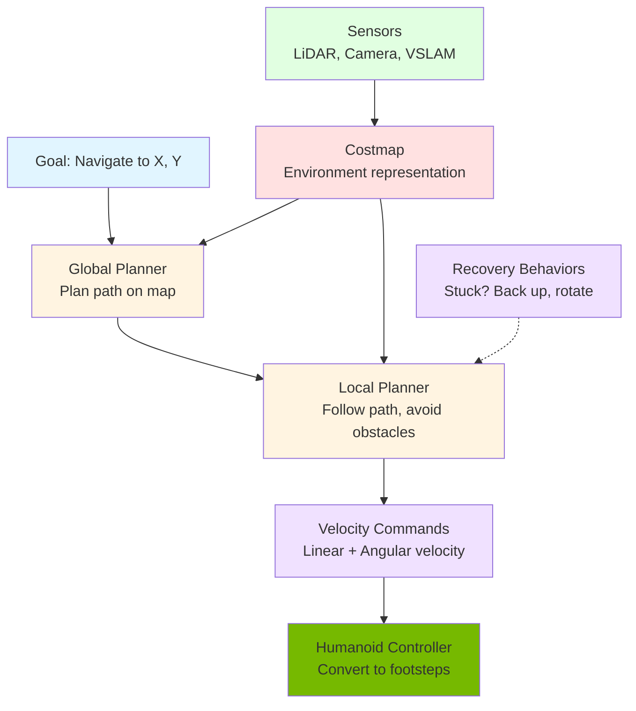

# Nav2: Path Planning for Bipedal Robots

## Introduction

**Nav2 (Navigation2)** is the ROS 2 navigation framework that enables autonomous mobile robots to navigate from point A to point B while avoiding obstacles. While originally designed for wheeled robots, Nav2 can be adapted for **bipedal humanoid robots** with special considerations for walking dynamics and stability.

This section covers Nav2 architecture, how to configure it for humanoids, and the unique challenges of bipedal navigation.

## Nav2 Architecture

Nav2 is a modular system with swappable plugins:



**Components**:
1. **Costmap**: 2D grid representing obstacles and free space
2. **Global Planner**: Computes optimal path from start to goal
3. **Local Planner (Controller)**: Follows path while avoiding dynamic obstacles
4. **Recovery Behaviors**: Actions when robot gets stuck

## Costmaps: Understanding the Environment

### What is a Costmap?

A **costmap** is a 2D occupancy grid where each cell has a cost:

- **0**: Free space (safe to traverse)
- **100-253**: Increasing proximity to obstacles
- **254**: Inscribed obstacle (robot footprint touches)
- **255**: Lethal obstacle (collision)

### Layered Costmaps

Nav2 builds costmaps from multiple layers:

**1. Static Layer**
- From pre-built map (e.g., SLAM map)
- Walls, furniture that don't move

**2. Obstacle Layer**
- From real-time sensor data (LiDAR, depth camera)
- Dynamic obstacles (people, boxes)

**3. Inflation Layer**
- Adds safety buffer around obstacles
- Cost increases near obstacles

**4. Voxel Layer** (optional)
- 3D obstacle representation
- Useful for humanoids (detect low obstacles, overhead clearance)

### Configuration for Humanoids

```yaml
# costmap_common_params.yaml
footprint: [[0.2, 0.15], [0.2, -0.15], [-0.2, -0.15], [-0.2, 0.15]]  # Humanoid footprint
inflation_radius: 0.5  # Safety margin around obstacles
cost_scaling_factor: 3.0  # How fast cost increases near obstacles

obstacle_layer:
  enabled: true
  observation_sources: lidar depth_camera
  lidar:
    sensor_frame: head_lidar_frame
    data_type: LaserScan
    topic: /scan
    marking: true
    clearing: true
  depth_camera:
    sensor_frame: head_camera_optical_frame
    data_type: PointCloud2
    topic: /depth/points
    max_obstacle_height: 2.0  # Detect obstacles up to 2m
    min_obstacle_height: 0.1  # Ignore floor
```

## Global Planning

### A* and Dijkstra Algorithms

**Global planners** compute optimal paths on the costmap:

**Dijkstra's Algorithm**:
- Finds shortest path
- Explores all directions equally
- Slow but guaranteed optimal

**A\* (A-star)**:
- Heuristic-guided search
- Explores toward goal preferentially
- Faster than Dijkstra

For humanoids: **A\*** with Manhattan or Euclidean heuristic.

### NavFn vs Smac Planner

| Planner | Algorithm | Features | Best For |
|---------|-----------|----------|----------|
| **NavFn** | Dijkstra/A* | Simple, fast | Wheeled robots, simple environments |
| **Smac Planner 2D** | Hybrid A* | Smooth paths, kinematic constraints | Car-like robots |
| **Smac Planner Lattice** | State lattice | Motion primitives, footstep planning | **Humanoid robots** |

For bipedal humanoids: **Smac Planner Lattice** with footstep primitives.

### Footstep Planning

Humanoids can't move arbitrarily—they must step:

```yaml
# Footstep motion primitives
motion_primitives:
  - step_forward: 0.3m
  - step_backward: 0.2m
  - step_left: 0.15m
  - step_right: 0.15m
  - turn_left: 15°
  - turn_right: 15°
```

Planner searches over footstep sequences instead of continuous motion.

## Local Planning (Controller)

### DWA (Dynamic Window Approach)

**DWA** samples velocity commands and evaluates them:

```
For each (linear_vel, angular_vel) in dynamic window:
  Simulate trajectory for N seconds
  Score based on:
    - Progress toward goal
    - Obstacle clearance
    - Path alignment
  Select best-scoring command
```

**Limitations for humanoids**:
- Assumes instantaneous velocity changes
- Doesn't model walking dynamics
- No stability constraints

### TEB (Timed Elastic Band)

**TEB** optimizes a trajectory considering kinematics and dynamics:

- Treats path as elastic band
- Optimizes waypoints and timing
- Enforces acceleration/velocity limits
- Respects minimum turning radius

**Better for humanoids**: Can model walking speed limits and turning constraints.

### Regulated Pure Pursuit

Follows global path while regulating speed near obstacles:

```python
# Simplified pure pursuit
lookahead_distance = 0.5  # meters
target_point = find_point_on_path(lookahead_distance)

# Compute steering angle to reach target
angular_velocity = compute_angle_to_target(current_pose, target_point)

# Regulate speed based on obstacle proximity
if obstacle_nearby:
    linear_velocity = 0.2  # Slow down
else:
    linear_velocity = 0.5  # Normal walking speed
```

Simple and robust for structured environments.

## Bipedal-Specific Considerations

### 1. Stability Constraints

Humanoids must maintain balance while walking:

**Zero Moment Point (ZMP)**:
- ZMP must stay inside support polygon
- Plan paths that don't require sudden direction changes
- Limit angular velocities during turns

**Configuration**:
```yaml
controller:
  max_vel_x: 0.5  # m/s (conservative for stability)
  max_vel_theta: 0.3  # rad/s (slow turns)
  acc_lim_x: 0.2  # Gentle acceleration
  acc_lim_theta: 0.2  # Gentle rotations
```

### 2. Footstep Planning

Unlike wheeled robots, humanoids take discrete steps:

**Footstep Constraints**:
- Step length: 0.1m - 0.4m
- Step width: 0.1m - 0.2m
- Step angle: -30° to +30°
- Minimum foot clearance: 0.05m

Use dedicated footstep planner or **motion primitives** in Smac Planner.

### 3. Obstacle Height Awareness

Humanoids can:
- **Step over** low obstacles (< 10cm)
- **Duck under** overhead obstacles
- **Navigate stairs** (requires 3D costmap)

**Voxel Layer** enables 3D obstacle representation:

```yaml
voxel_layer:
  enabled: true
  max_obstacle_height: 2.0
  min_obstacle_height: 0.05  # Step over lower obstacles
  mark_threshold: 2  # Mark cell as obstacle if ≥2 voxels occupied
```

### 4. Recovery Behaviors

When stuck, humanoids have limited recovery options:

**Standard Recoveries**:
- **Back up**: Walk backward
- **Rotate**: Turn in place
- **Clear costmap**: Reset obstacle layer

**Humanoid-Specific**:
- **Sidestep**: Step sideways to avoid obstacle
- **High step**: Lift foot higher to clear obstacle
- **Stop and replan**: Request human assistance

## Nav2 Lifecycle and Behavior Trees

### Behavior Tree Structure

Nav2 uses **behavior trees** (BT) for decision-making:

```xml
<root>
  <Sequence>
    <ComputePathToPose goal="${goal}"/>
    <FollowPath path="${path}"/>
    <GoalReached/>
  </Sequence>
  <Recovery>
    <BackUp/>
    <ClearCostmap/>
    <Spin/>
  </Recovery>
</root>
```

**Execution**:
1. Compute global path
2. Follow path with local planner
3. If stuck → Execute recovery
4. Retry or fail

### Customizing for Humanoids

Add humanoid-specific behaviors:

```xml
<root>
  <Sequence>
    <!-- Check stability before moving -->
    <CheckBalanceCondition/>

    <!-- Plan path with footstep constraints -->
    <ComputePathToPose planner="SmacPlannerLattice"/>

    <!-- Follow path with stability monitoring -->
    <FollowPathWithStabilityCheck path="${path}"/>

    <!-- Succeeded -->
    <GoalReached/>
  </Sequence>

  <Recovery>
    <!-- Humanoid-specific recovery -->
    <StabilizeBalance/>
    <SidestepRecovery/>
    <ClearCostmap/>
  </Recovery>
</root>
```

## Launching Nav2 for Humanoids

### Configuration Files

Create Nav2 parameter file:

```yaml
# nav2_params.yaml
bt_navigator:
  ros__parameters:
    global_frame: map
    robot_base_frame: base_link
    transform_tolerance: 0.1
    default_nav_to_pose_bt_xml: /path/to/humanoid_nav.xml

controller_server:
  ros__parameters:
    controller_plugins: ["FollowPath"]
    FollowPath:
      plugin: "dwb_core::DWBLocalPlanner"
      max_vel_x: 0.5
      max_vel_theta: 0.3

planner_server:
  ros__parameters:
    planner_plugins: ["GridBased"]
    GridBased:
      plugin: "nav2_smac_planner/SmacPlannerLattice"
      motion_model_for_search: "FOOTSTEP"  # Humanoid mode

costmap:
  global_costmap:
    global_frame: map
    robot_base_frame: base_link
    update_frequency: 1.0
    publish_frequency: 1.0
    footprint: [[0.2, 0.15], [0.2, -0.15], [-0.2, -0.15], [-0.2, 0.15]]
    inflation_layer:
      inflation_radius: 0.5
```

### Launch Nav2

```bash
ros2 launch nav2_bringup bringup_launch.py \
    params_file:=/path/to/nav2_params.yaml \
    map:=/path/to/map.yaml
```

### Send Navigation Goals

```bash
# Command-line goal
ros2 topic pub /goal_pose geometry_msgs/PoseStamped "{
  header: {frame_id: 'map'},
  pose: {
    position: {x: 5.0, y: 2.0, z: 0.0},
    orientation: {x: 0.0, y: 0.0, z: 0.0, w: 1.0}
  }
}"
```

Or use **RViz Nav2 plugin**: Click "Nav2 Goal" button, click target location on map.

## Debugging Navigation

### Common Issues

**Robot won't move**:
- Check costmap: Is goal in free space?
- Check TF: Are all frames published?
- Check velocity limits: Too conservative?

**Robot gets stuck**:
- Inflation radius too large?
- Recovery behaviors failing?
- Obstacle layer marking incorrectly?

**Unstable walking**:
- Velocity limits too high
- Poor odometry from Visual SLAM
- Need to fuse with IMU

### Visualization in RViz

Add Nav2 displays:
- **Global Costmap**: View planned path
- **Local Costmap**: View obstacle avoidance
- **Global Plan**: Planned path (green)
- **Local Plan**: Executed trajectory (red)

## Summary

Nav2 provides autonomous navigation for humanoid robots:

**Architecture**:
- **Costmaps**: 2D environment representation from sensors
- **Global Planner**: Optimal path planning (A*, Smac Lattice)
- **Local Planner**: Obstacle avoidance and path following (DWA, TEB)
- **Recovery**: Behaviors when stuck

**Bipedal Adaptations**:
- Footstep planning with motion primitives
- Stability constraints (conservative velocities)
- 3D obstacle awareness (voxel layer)
- Custom recovery behaviors (sidestep, stabilize)

**Isaac Integration**:
- Use Visual SLAM for localization
- Sensor data (LiDAR, depth) for costmaps
- GPU acceleration for real-time planning

With Nav2, humanoid robots can autonomously navigate complex environments while maintaining balance and avoiding obstacles.

---

**Continue to**: [Synthetic Data Generation](./synthetic-data.md)

## References

Open Robotics. (2024). *Nav2 Documentation*. https://nav2.org/

Macenski, S., et al. (2020). The Marathon 2: A Navigation System. *IEEE/RSJ International Conference on Intelligent Robots and Systems*.
