# Visual SLAM for Humanoid Navigation

## Introduction

**Visual SLAM (Simultaneous Localization and Mapping)** enables robots to build maps of unknown environments while simultaneously tracking their own position—using only camera data. For humanoid robots, Visual SLAM is essential for autonomous navigation without relying on GPS or external positioning systems.

This section covers how Visual SLAM works, why it's challenging for humanoids, and how to deploy Isaac ROS Visual SLAM for production robotics.

## What is SLAM?

SLAM solves two interrelated problems:

1. **Localization**: Where am I in the environment?
2. **Mapping**: What does the environment look like?

**The Challenge**: You need a map to localize, but you need to be localized to build a map. SLAM solves both simultaneously.

### SLAM Variants

| Type | Sensors | Output | Use Case |
|------|---------|--------|----------|
| **Visual SLAM** | Cameras (mono/stereo) | 3D map + pose | Indoor navigation, AR/VR |
| **Lidar SLAM** | 2D/3D LiDAR | 2D/3D map + pose | Outdoor navigation, mapping |
| **RGB-D SLAM** | Depth camera | Dense 3D map + pose | Manipulation, dense mapping |
| **Visual-Inertial** | Camera + IMU | Pose + sparse map | Drones, fast-moving robots |

For humanoids, **Visual SLAM** or **Visual-Inertial** SLAM is preferred due to:
- Lightweight sensors (cameras weigh much less than LiDAR)
- Lower cost
- Rich visual information for object recognition
- IMU provides fast updates for balance control

## How Visual SLAM Works

### The Visual SLAM Pipeline

```mermaid
graph LR
    A[Camera Images] --> B[Feature Extraction<br/>ORB, SIFT, etc.]
    B --> C[Feature Tracking<br/>Match across frames]
    C --> D[Motion Estimation<br/>Visual Odometry]
    D --> E[Local Mapping<br/>3D Points]
    E --> F[Loop Closure<br/>Detect revisited places]
    F --> G[Global Optimization<br/>Bundle Adjustment]
    G --> H[Pose + Map Output]

    style A fill:#e1f5ff
    style B fill:#fff4e1
    style C fill:#fff4e1
    style D fill:#ffe1e1
    style E fill:#e1ffe1
    style F fill:#f0e1ff
    style G fill:#f0e1ff
    style H fill:#76b900
```



Let's break down each step.

### 1. Feature Extraction

**Features** are distinctive image points that can be reliably detected across frames.

**Common feature detectors**:
- **ORB (Oriented FAST and Rotated BRIEF)**: Fast, rotation-invariant
- **SIFT (Scale-Invariant Feature Transform)**: Robust but slow
- **AKAZE**: Fast and rotation/scale invariant

**Feature descriptor**: A numerical vector describing the local appearance around each feature point.

Example: Corner of a table, edge of a door frame, texture pattern on wall.

### 2. Feature Tracking

Match features between consecutive frames:

```
Frame t:   Feature A at pixel (100, 200)
Frame t+1: Feature A at pixel (105, 202)
→ Feature moved 5 pixels right, 2 pixels down
```

**Matching methods**:
- Descriptor distance (Euclidean, Hamming)
- Optical flow (track pixels across frames)
- RANSAC (outlier rejection)

### 3. Visual Odometry (Motion Estimation)

Estimate camera motion from feature matches:

```python
# Simplified visual odometry
matched_points_t = [[100, 200], [300, 150], ...]
matched_points_t1 = [[105, 202], [305, 153], ...]

# Compute essential matrix
E = compute_essential_matrix(points_t, points_t1, camera_matrix)

# Decompose to rotation and translation
R, t = decompose_essential_matrix(E)

# Update pose
camera_pose = camera_pose * transform(R, t)
```

This estimates the robot's motion between frames.

### 4. Mapping

Create 3D map points by triangulating features seen from multiple viewpoints:

```
Camera pose 1: Feature at pixel (100, 200)
Camera pose 2: Feature at pixel (120, 180)
→ Triangulate → 3D point at (1.5m, 0.3m, 2.0m)
```

**Map representation**:
- **Sparse map**: Cloud of 3D feature points (fast, lightweight)
- **Dense map**: Full 3D reconstruction (slow, memory-intensive)

Visual SLAM typically uses **sparse maps** for real-time performance.

### 5. Loop Closure Detection

When the robot revisits a previously mapped area, detect it and correct accumulated drift:

```
Current location looks similar to location visited 5 minutes ago
→ Recognize loop closure
→ Add constraint: "These two poses should be close"
→ Trigger global optimization
```

**Methods**:
- **Bag of Words** (BoW): Visual vocabulary for fast image comparison
- **Deep learning**: CNN embeddings for place recognition

### 6. Global Optimization (Bundle Adjustment)

Refine all camera poses and 3D points simultaneously to minimize reprojection error:

```
For all frames and all 3D points:
  Project 3D point to image using current pose estimate
  Measure error between projected and observed pixel location
  Adjust poses and 3D points to minimize total error
```

This distributes accumulated error across the entire trajectory.

## Visual SLAM for Humanoid Robots

### Unique Challenges

**1. Camera Motion**
- **Walking-induced shake**: Bipedal locomotion causes oscillating camera motion
- **Vertical movement**: Height changes during stairs, crouching
- **Fast head turns**: Sudden viewpoint changes

**Solution**: Use **IMU fusion** to predict motion between frames, filter high-frequency vibrations.

**2. Dynamic Environments**
- **Moving people**: Features on people are not static landmarks
- **Doors opening/closing**: Environment changes over time

**Solution**: **Detect and filter** dynamic objects using optical flow or semantic segmentation.

**3. Featureless Areas**
- **White walls**: Few distinguishable features
- **Repetitive patterns**: Ambiguous matching (tiled floors)

**Solution**: **Multi-camera setup** (stereo or fisheye), **semantic landmarks** (recognize doors, furniture).

**4. Computational Constraints**
- Real-time processing required (30+ Hz)
- Limited compute on mobile platforms

**Solution**: **GPU acceleration** (Isaac ROS Visual SLAM), **lightweight features** (ORB), **keyframe selection**.

## Isaac ROS Visual SLAM

### GPU-Accelerated SLAM

Isaac ROS Visual SLAM leverages NVIDIA GPUs for real-time performance:

```
CPU Visual SLAM: 10-15 FPS (Intel i7)
GPU Visual SLAM: 60+ FPS (NVIDIA Jetson Orin)
```

This enables humanoids to navigate while running perception, planning, and control simultaneously.

### Installation and Setup

Install Isaac ROS packages:

```bash
# Clone Isaac ROS repository
cd ~/ros2_ws/src
git clone https://github.com/NVIDIA-ISAAC-ROS/isaac_ros_visual_slam

# Install dependencies
cd ~/ros2_ws
rosdep install --from-paths src --ignore-src -r -y

# Build
colcon build --packages-up-to isaac_ros_visual_slam

# Source
source install/setup.bash
```

### Configuration

Launch Visual SLAM with stereo camera:

```bash
ros2 launch isaac_ros_visual_slam isaac_ros_visual_slam.launch.py \
    left_camera_topic:=/humanoid/left_camera/image_raw \
    right_camera_topic:=/humanoid/right_camera/image_raw \
    camera_info_topic:=/humanoid/left_camera/camera_info
```

**Published topics**:
- `/visual_slam/tracking/odometry` (nav_msgs/Odometry): Current pose estimate
- `/visual_slam/tracking/vo_pose` (geometry_msgs/PoseStamped): Visual odometry pose
- `/visual_slam/vis/observations` (visualization_msgs/MarkerArray): Feature points
- `/visual_slam/vis/map_points` (sensor_msgs/PointCloud2): 3D map

### Integrating with Humanoid

Fuse Visual SLAM with IMU for robust state estimation:

```python
import rclpy
from rclpy.node import Node
from nav_msgs.msg import Odometry
from sensor_msgs.msg import Imu
from geometry_msgs.msg import PoseStamped

class HumanoidStateEstimator(Node):
    def __init__(self):
        super().__init__('state_estimator')

        # Subscribe to Visual SLAM
        self.vslam_sub = self.create_subscription(
            Odometry, '/visual_slam/tracking/odometry',
            self.vslam_callback, 10
        )

        # Subscribe to IMU
        self.imu_sub = self.create_subscription(
            Imu, '/humanoid/imu/data',
            self.imu_callback, 10
        )

        # Publish fused state
        self.pose_pub = self.create_publisher(
            PoseStamped, '/humanoid/pose', 10
        )

    def vslam_callback(self, msg):
        # Visual SLAM provides position + orientation
        self.slam_pose = msg.pose.pose

    def imu_callback(self, msg):
        # IMU provides high-frequency orientation updates
        # Fuse with SLAM pose
        fused_pose = self.fuse_slam_imu(self.slam_pose, msg)
        self.pose_pub.publish(fused_pose)
```

## Best Practices for Humanoid Visual SLAM

### 1. Camera Placement

**Head-mounted stereo cameras**:
- Wide baseline (10-20cm) for better depth estimation
- Forward-facing for navigation
- Tilt slightly downward to see ground obstacles

**Multiple cameras**:
- Front camera: Navigation
- Downward camera: Foot placement, stair detection
- Side cameras: Peripheral awareness

### 2. Feature Selection

Use **ORB features** for real-time performance:
- Fast to detect and match
- Rotation and scale invariant
- Good balance of speed and robustness

For challenging environments, upgrade to **AKAZE** or **SIFT**.

### 3. Keyframe Strategy

Don't process every frame—select keyframes:

```python
# Keyframe selection criteria
if camera_moved > 0.5m or rotated > 15° or time_since_last > 1s:
    add_keyframe()
```

Reduces computation and improves map quality.

### 4. Loop Closure Tuning

Adjust loop closure sensitivity:
- **Loose**: Frequent closures, risk of false matches
- **Strict**: Few closures, accumulated drift

For indoor humanoids: **Moderate** (recognize rooms, hallways).

### 5. Handling Dynamic Objects

Filter moving objects to prevent map corruption:

```python
# Use semantic segmentation to detect people
person_mask = run_person_detector(image)

# Exclude features inside person mask
features = extract_features(image)
static_features = [f for f in features if not in_mask(f, person_mask)]
```

## Debugging Visual SLAM

### Common Issues

**Tracking Lost**:
- Symptoms: Odometry jumps, map degrades
- Causes: Fast motion, low-texture environment
- Fix: Slow down, add visual landmarks, tune feature parameters

**Poor Loop Closure**:
- Symptoms: Drift accumulates, revisited places not recognized
- Causes: Appearance changed (lighting, moved objects)
- Fix: Use appearance-invariant features, combine with other sensors

**High Computational Load**:
- Symptoms: Delays, dropped frames
- Causes: Too many features, frequent loop closures
- Fix: Reduce features, increase keyframe spacing, use GPU acceleration

### Visualization

Use RViz to monitor SLAM:

```bash
rviz2 -d $(ros2 pkg prefix isaac_ros_visual_slam)/share/isaac_ros_visual_slam/rviz/vslam.rviz
```

Display:
- Current pose trajectory (green line)
- Feature observations (blue points)
- Map points (white cloud)
- Loop closure edges (red lines)

## Summary

Visual SLAM enables autonomous humanoid navigation by:

- **Building maps** of unknown environments using camera observations
- **Tracking pose** in real-time without external positioning
- **Closing loops** to correct drift when revisiting areas
- **Fusing with IMU** for robust state estimation during walking

**Key Concepts**:
- Feature extraction and matching (ORB, SIFT)
- Visual odometry (motion from camera)
- Sparse 3D mapping (triangulation)
- Loop closure detection and optimization

**Isaac ROS Visual SLAM** provides GPU-accelerated performance (60+ FPS) for real-time humanoid navigation.

**Challenges for humanoids**:
- Camera shake from walking
- Dynamic environments (people moving)
- Computational constraints on mobile platforms

**Next**: Learn how to use Visual SLAM for autonomous navigation with Nav2.

---

**Continue to**: [Nav2: Path Planning for Bipedal Robots](./nav2.md)

## References

NVIDIA. (2024). *Isaac ROS Visual SLAM*. https://nvidia-isaac-ros.github.io/repositories_and_packages/isaac_ros_visual_slam/

Mur-Artal, R., & Tardós, J. D. (2017). ORB-SLAM2: An Open-Source SLAM System for Monocular, Stereo, and RGB-D Cameras. *IEEE Transactions on Robotics*.
