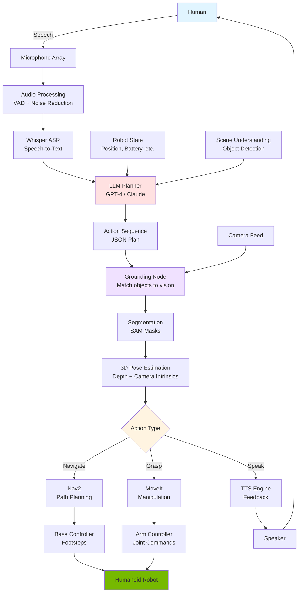

# Capstone: Autonomous Humanoid Architecture

## Introduction

You've learned the individual components:
- **LLM Planning**: Decompose natural language into actions
- **Whisper**: Convert speech to text
- **Multimodal Perception**: Ground language in vision

Now it's time to integrate everything into a **production-ready VLA system** for autonomous humanoid robots.

This capstone covers:
- End-to-end VLA architecture
- ROS 2 node design patterns
- Three complete natural language → action examples
- Deployment considerations and best practices

## End-to-End VLA Architecture

### System Overview



### ROS 2 Node Architecture

```
humanoid_vla/
├── audio_processing_node       # Audio capture, VAD, noise reduction
├── whisper_asr_node            # Speech recognition
├── llm_planner_node            # Task decomposition
├── grounding_node              # Vision-language matching
├── segmentation_node           # SAM segmentation
├── grasp_planner_node          # 3D grasp pose computation
├── navigation_manager_node     # Nav2 interface
├── manipulation_manager_node   # MoveIt interface
├── action_executor_node        # Orchestrates execution
└── state_manager_node          # Robot state tracking
```

## Complete Examples

### Example 1: "Clean the table"

**User Command:**
```
User: "Clean the table"
```

**Step 1: Speech Recognition**
```python
# Whisper ASR Node
audio_input = microphone.capture()
text = whisper.transcribe(audio_input)
# Output: "clean the table"
```

**Step 2: LLM Decomposition**
```python
# LLM Planner Node
prompt = f"""
Robot capabilities: navigate, detect_objects, grasp, place, speak
Current location: living_room
Known locations: table, counter, trash_bin

User command: "clean the table"

Decompose into action sequence (JSON):
"""

llm_response = llm.chat(prompt)

# LLM Output:
{
  "plan": [
    {"action": "speak", "text": "I'll clean the table for you"},
    {"action": "navigate", "location": "table"},
    {"action": "detect_objects", "area": "table_surface"},
    {"action": "foreach", "objects": "detected_objects", "actions": [
      {"action": "grasp", "object": "$object"},
      {"action": "classify_object", "object": "$object"},
      {"action": "navigate", "location": "$trash_or_counter"},
      {"action": "place", "location": "$destination"}
    ]},
    {"action": "speak", "text": "Table is clean"}
  ],
  "reasoning": "Need to detect objects on table, categorize them, and place in appropriate location (trash or counter)"
}
```

**Step 3: Visual Grounding**
```python
# Grounding Node
camera_image = camera.get_latest_frame()

# Detect all objects on table
detections = owl_vit.detect(
    image=camera_image,
    queries=["objects on a table"]
)

# detections: [
#   {id: 0, label: "cup", bbox: [320, 240, 80, 120], score: 0.91},
#   {id: 1, label: "plate", bbox: [500, 280, 100, 100], score: 0.87},
#   {id: 2, label: "napkin", bbox: [200, 300, 60, 40], score: 0.79}
# ]
```

**Step 4: Segmentation**
```python
# Segmentation Node
for det in detections:
    mask = sam.segment(camera_image, bbox=det.bbox)
    det.mask = mask
```

**Step 5: 3D Pose Estimation**
```python
# Grasp Planner Node
depth_image = depth_camera.get_latest_frame()

for det in detections:
    # Get depth at object center
    center_depth = depth_image[det.bbox.center_y, det.bbox.center_x]

    # Convert to 3D point
    point_3d = camera_model.projectPixelTo3dRay(
        (det.bbox.center_x, det.bbox.center_y)
    ) * center_depth

    # Compute grasp pose
    grasp_pose = compute_grasp_pose(
        mask=det.mask,
        point_3d=point_3d,
        surface_normal=estimate_normal(depth_image, det.mask)
    )

    det.grasp_pose = grasp_pose
```

**Step 6: Classification and Sorting**
```python
# Action Executor Node
for det in detections:
    # Navigate to object
    navigate_to(det.grasp_pose.position)

    # Grasp object
    grasp(det.grasp_pose)

    # Classify: trash or keep?
    classification = clip.classify(
        camera.get_gripper_view(),
        labels=["trash", "dishes", "clean_items"]
    )

    if classification == "trash":
        destination = "trash_bin"
    elif classification == "dishes":
        destination = "sink"
    else:
        destination = "counter"

    # Navigate and place
    navigate_to(destination)
    place(destination)

    # Return to table
    navigate_to("table")

# Final feedback
speak("Table is clean")
```

**Execution Timeline:**
```
0:00 - User speaks: "Clean the table"
0:02 - Whisper transcribes
0:03 - LLM generates plan
0:04 - Robot: "I'll clean the table for you"
0:06 - Navigate to table (2 seconds)
0:08 - Detect 3 objects on table
0:09 - Segment and compute grasp poses
0:10 - Grasp cup → Classify: dishes → Place in sink (15s)
0:25 - Grasp plate → Classify: dishes → Place in sink (15s)
0:40 - Grasp napkin → Classify: trash → Place in bin (12s)
0:52 - Robot: "Table is clean"
```

### Example 2: "Bring me a drink"

**User Command:**
```
User: "Bring me a drink"
```

**Step 1-2: Speech + LLM Planning**
```python
llm_response = {
  "plan": [
    {"action": "speak", "text": "I'll get you a drink"},
    {"action": "navigate", "location": "kitchen"},
    {"action": "detect_objects", "query": "drinks"},
    {"action": "select_object", "criteria": "closest_drink"},
    {"action": "grasp", "object": "selected_drink"},
    {"action": "navigate", "location": "user"},
    {"action": "place", "location": "table_near_user"},
    {"action": "speak", "text": "Here's your drink"}
  ]
}
```

**Step 3: Visual Grounding in Kitchen**
```python
# Navigate to kitchen
navigate_to("kitchen")

# Detect drinks
drink_detections = owl_vit.detect(
    camera.get_latest_frame(),
    queries=["a bottle of water", "a can of soda", "a glass"]
)

# Select closest accessible drink
selected_drink = min(
    drink_detections,
    key=lambda d: distance(robot_position, d.position_3d)
)
```

**Step 4: Grasp Planning with Collision Avoidance**
```python
# Segment drink
mask = sam.segment(camera_image, bbox=selected_drink.bbox)

# Compute multiple grasp candidates
grasp_candidates = compute_grasp_candidates(
    object_mask=mask,
    depth_image=depth_image,
    num_candidates=5
)

# Check collision-free grasps with MoveIt
for candidate in grasp_candidates:
    trajectory = moveit.plan_grasp(candidate)
    if trajectory.success and not trajectory.collision:
        grasp_pose = candidate
        break
```

**Step 5: Execute Grasp**
```python
# Pre-grasp pose
moveit.move_to_pose(grasp_pose.pre_grasp)

# Open gripper
gripper.open()

# Approach
moveit.move_to_pose(grasp_pose.grasp)

# Close gripper
gripper.close()

# Lift
moveit.move_to_pose(grasp_pose.lift)
```

**Step 6: Return to User**
```python
# Detect user with person detection
user_detections = detect_persons(camera_image)
user_position = user_detections[0].position_3d

# Navigate to user
navigate_to_person(user_position, safe_distance=1.0)

# Find nearby table
table_detections = owl_vit.detect(camera_image, ["a table"])
place_location = table_detections[0].surface_point

# Place drink gently
place_object(place_location, gentle=True)

# Feedback
speak("Here's your drink")
```

### Example 3: "Follow me to the kitchen"

**User Command:**
```
User: "Follow me to the kitchen"
```

**Step 1-2: Speech + LLM Planning**
```python
llm_response = {
  "plan": [
    {"action": "speak", "text": "I'll follow you"},
    {"action": "track_person", "target": "user"},
    {"action": "follow_at_distance", "distance": 1.5, "until": "kitchen"},
    {"action": "speak", "text": "We're in the kitchen"}
  ]
}
```

**Step 3: Person Detection and Tracking**
```python
class PersonFollower(Node):
    def __init__(self):
        super().__init__('person_follower')

        # Person detector (YOLOv8-pose)
        self.person_detector = YOLOv8Pose()

        # State
        self.tracking_person_id = None
        self.following = False

    def follow_person(self):
        while self.following:
            # Detect persons
            detections = self.person_detector.detect(camera.get_frame())

            if self.tracking_person_id is None:
                # Start tracking closest person
                self.tracking_person_id = min(
                    detections,
                    key=lambda d: d.distance
                ).id

            # Get tracked person
            person = next(
                (d for d in detections if d.id == self.tracking_person_id),
                None
            )

            if person is None:
                # Lost track
                self.stop_and_search()
                continue

            # Maintain distance
            target_distance = 1.5  # meters
            current_distance = person.distance

            if current_distance > target_distance + 0.3:
                # Person too far, move closer
                self.navigate_toward(person.position, speed=0.4)
            elif current_distance < target_distance - 0.3:
                # Person too close, back up
                self.navigate_away(person.position, speed=0.2)
            else:
                # Maintain position
                self.stop()

            # Check if reached kitchen
            current_location = self.get_current_location()
            if current_location == "kitchen":
                self.following = False
                speak("We're in the kitchen")
```

**Step 4: Obstacle Avoidance While Following**
```python
def navigate_toward(self, person_position, speed):
    # Get costmap from Nav2
    costmap = self.get_local_costmap()

    # Compute vector to person
    direction = person_position - self.get_position()
    direction_normalized = direction / np.linalg.norm(direction)

    # Check if path is clear
    if is_path_clear(costmap, direction_normalized):
        # Move directly toward person
        velocity = direction_normalized * speed
        self.publish_velocity(velocity)
    else:
        # Compute detour around obstacle
        detour_path = self.plan_local_detour(person_position)
        self.follow_path(detour_path, speed)
```

**Step 5: Re-acquisition if Person Lost**
```python
def stop_and_search(self):
    self.stop()
    speak("I lost you. Please wave.")

    # Rotate in place to search
    for angle in [0, 90, 180, 270]:
        self.rotate_to(angle)
        time.sleep(1)

        # Detect persons
        detections = self.person_detector.detect(camera.get_frame())

        if len(detections) > 0:
            # Found person, resume tracking
            self.tracking_person_id = detections[0].id
            speak("Found you!")
            return

    # Still lost
    speak("I can't find you. Please come back to me.")
```

## Production Deployment

### Hardware Requirements

**Compute:**
- NVIDIA Jetson Orin (32GB) or higher
- GPU acceleration essential for real-time VLA

**Sensors:**
- Stereo cameras (Visual SLAM + depth)
- Microphone array (4+ mics for beamforming)
- IMU (balance and state estimation)
- LiDAR (optional, for robust navigation)

**Actuators:**
- 7-DOF arms (manipulation)
- 6-DOF legs (bipedal walking)
- 2-finger gripper (grasping)

### Software Stack

```yaml
# docker-compose.yml
services:
  ros2_core:
    image: osrf/ros:humble-desktop
    command: ros2 launch humanoid_vla full_system.launch.py

  whisper_asr:
    image: humanoid_vla/whisper:latest
    runtime: nvidia
    environment:
      - MODEL_SIZE=small
      - LANGUAGE=en

  llm_planner:
    image: humanoid_vla/llm_planner:latest
    environment:
      - LLM_API_KEY=${OPENAI_API_KEY}
      - LLM_MODEL=gpt-4

  vision_pipeline:
    image: humanoid_vla/vision:latest
    runtime: nvidia
    volumes:
      - /dev/video0:/dev/video0

  nav2:
    image: osrf/ros:humble-navigation
    command: ros2 launch nav2_bringup bringup_launch.py
```

### Launch Configuration

```python
# full_system.launch.py
from launch import LaunchDescription
from launch_ros.actions import Node

def generate_launch_description():
    return LaunchDescription([
        # Audio pipeline
        Node(package='humanoid_vla', executable='audio_processing_node'),
        Node(package='humanoid_vla', executable='whisper_asr_node'),

        # Vision pipeline
        Node(package='humanoid_vla', executable='camera_node'),
        Node(package='humanoid_vla', executable='grounding_node'),
        Node(package='humanoid_vla', executable='segmentation_node'),

        # Planning and execution
        Node(package='humanoid_vla', executable='llm_planner_node'),
        Node(package='humanoid_vla', executable='action_executor_node'),

        # Navigation
        Node(package='nav2_bringup', executable='nav2_bringup'),

        # Manipulation
        Node(package='moveit', executable='move_group'),

        # State management
        Node(package='humanoid_vla', executable='state_manager_node'),
    ])
```

## Best Practices

### 1. Human-in-the-Loop

Always confirm critical actions:

```python
def execute_action_with_confirmation(action):
    if is_critical_action(action):
        speak(f"I'm about to {action}. Should I proceed?")
        response = wait_for_confirmation(timeout=10)

        if response != "yes":
            speak("Action cancelled")
            return False

    return execute_action(action)
```

### 2. Graceful Degradation

Handle failures at every level:

```python
def robust_execute(action_plan):
    for i, action in enumerate(action_plan):
        try:
            result = execute_action(action)

            if result.failed:
                # Ask LLM to replan from current state
                new_plan = llm.replan(
                    original_plan=action_plan,
                    failed_action=action,
                    error=result.error,
                    remaining_actions=action_plan[i+1:]
                )
                return robust_execute(new_plan)

        except Exception as e:
            speak(f"Something went wrong: {e}")
            return False

    return True
```

### 3. Safety Constraints

Enforce safety rules in code:

```python
def validate_action(action):
    # No grasping while navigating
    if robot.is_navigating() and action.type == "grasp":
        return False, "Cannot grasp while moving"

    # Weight limit
    if action.type == "grasp" and action.object.weight > 5.0:
        return False, "Object too heavy"

    # Person proximity
    if person_detected_in_path() and action.type == "navigate":
        return False, "Person in path"

    return True, "Safe"
```

### 4. Monitoring and Logging

Log everything for debugging:

```python
class ActionLogger(Node):
    def __init__(self):
        super().__init__('action_logger')

        self.action_log = []

    def log_action(self, action, result):
        entry = {
            "timestamp": time.time(),
            "action": action,
            "result": result,
            "robot_state": self.get_robot_state(),
            "battery": self.get_battery_level()
        }

        self.action_log.append(entry)

        # Save to database
        self.db.insert(entry)
```

## Summary

This capstone demonstrated:

**Complete VLA Pipeline:**
- Speech → Whisper → LLM → Grounding → Segmentation → Execution
- ROS 2 node architecture for production systems
- Real-time integration with Nav2 and MoveIt

**Three Complete Examples:**
1. **"Clean the table"**: Detection → Classification → Sorting
2. **"Bring me a drink"**: Navigation → Manipulation → Delivery
3. **"Follow me"**: Person tracking → Dynamic following

**Production Deployment:**
- Hardware requirements (Jetson Orin + sensors)
- Docker containerization
- Launch file orchestration

**Best Practices:**
- Human-in-the-loop confirmation
- Graceful degradation and replanning
- Safety constraints enforcement
- Comprehensive logging

**The Future:**
VLA systems are rapidly evolving. Expect:
- Faster LLMs (sub-second planning)
- Better vision models (GPT-4V successors)
- End-to-end learned VLA policies
- Improved sim-to-real transfer

You now have the complete toolkit to build autonomous humanoid robots that understand and execute natural language commands!

---

**Congratulations!** You've completed Module 4. Continue to [References](../references.md) for the complete bibliography.

## References

Ahn, M., et al. (2022). Do As I Can, Not As I Say: Grounding Language in Robotic Affordances. *arXiv preprint* arXiv:2204.01691.

Driess, D., et al. (2023). PaLM-E: An Embodied Multimodal Language Model. *arXiv preprint* arXiv:2303.03378.

Brohan, A., et al. (2023). RT-2: Vision-Language-Action Models Transfer Web Knowledge to Robotic Control. *arXiv preprint* arXiv:2307.15818.
