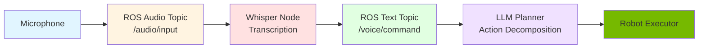

# Whisper Speech Recognition

## Introduction

Voice commands are the most natural way for humans to interact with robots. **OpenAI Whisper** is a state-of-the-art automatic speech recognition (ASR) system that converts spoken language into text with remarkable accuracy—even in noisy environments.

This section covers Whisper architecture, ROS 2 integration, and building a complete voice command pipeline for humanoid robots.

## Why Whisper for Robotics?

### Comparison with Other ASR Systems

| System | Accuracy | Languages | Robustness | Latency | Cost |
|--------|----------|-----------|------------|---------|------|
| **Whisper** | 95%+ | 99 languages | Excellent | ~1-3s | Free (self-hosted) |
| Google Speech-to-Text | 95%+ | 125+ | Good | ~0.5s | $0.006/15s |
| Mozilla DeepSpeech | 90%+ | English | Moderate | ~1s | Free |
| CMU Sphinx | 85% | Limited | Poor | Fast | Free |

**Whisper Advantages for Humanoids:**
- **Multilingual**: Supports 99 languages out of the box
- **Noise robust**: Trained on 680,000 hours of diverse audio
- **No internet required**: Runs locally on robot
- **Open source**: Free and customizable
- **High accuracy**: Matches commercial systems

### Whisper Model Sizes

| Model | Parameters | VRAM | Speed | WER (English) | Use Case |
|-------|------------|------|-------|---------------|----------|
| `tiny` | 39M | ~1GB | 32x realtime | 5.0% | Fast prototyping |
| `base` | 74M | ~1GB | 16x realtime | 3.5% | Mobile robots |
| `small` | 244M | ~2GB | 6x realtime | 2.8% | **Humanoids** |
| `medium` | 769M | ~5GB | 2x realtime | 2.3% | High accuracy |
| `large` | 1550M | ~10GB | 1x realtime | 2.0% | Server deployment |

For humanoid robots: **`small`** model provides best speed/accuracy trade-off.

## Whisper Architecture

### How Whisper Works

```mermaid
graph LR
    A[Audio Input<br/>16kHz PCM] --> B[Encoder<br/>Mel Spectrogram]
    B --> C[Transformer Encoder<br/>Audio Features]
    C --> D[Transformer Decoder<br/>Text Generation]
    D --> E[Text Output<br/>"Bring me a drink"]

    style A fill:#e1f5ff
    style B fill:#fff4e1
    style C fill:#ffe1e1
    style D fill:#e1ffe1
    style E fill:#76b900
```

**Pipeline:**
1. **Audio Input**: Raw audio at 16kHz sampling rate
2. **Mel Spectrogram**: Convert audio to frequency representation
3. **Encoder**: Extract audio features with Transformer
4. **Decoder**: Generate text token by token
5. **Output**: Transcribed text

### Key Features

**Timestamps**: Whisper provides word-level timestamps:
```python
{
  "text": "Bring me a drink",
  "segments": [
    {"start": 0.0, "end": 0.5, "text": "Bring"},
    {"start": 0.5, "end": 0.8, "text": "me"},
    {"start": 0.8, "end": 1.0, "text": "a"},
    {"start": 1.0, "end": 1.5, "text": "drink"}
  ]
}
```

**Language Detection**: Automatically detects language:
```python
whisper.detect_language(audio)
# Returns: ("en", 0.98)  # English with 98% confidence
```

**Translation**: Translates non-English to English:
```python
# Spanish audio: "Tráeme una bebida"
result = whisper.transcribe(audio, task="translate")
# Output: "Bring me a drink"
```

## Installation and Setup

### Install Whisper

```bash
# Install Whisper
pip install openai-whisper

# Install ffmpeg (required for audio processing)
sudo apt install ffmpeg

# Test installation
whisper --help
```

### Download Model

```python
import whisper

# Download and cache model (one-time operation)
model = whisper.load_model("small")  # ~500MB download
```

Models are cached in `~/.cache/whisper/`.

## ROS 2 Integration

### Voice Command Pipeline



### Whisper ROS 2 Node

Create a ROS 2 node that subscribes to audio and publishes transcriptions:

```python
import rclpy
from rclpy.node import Node
from audio_common_msgs.msg import AudioStamped
from std_msgs.msg import String
import whisper
import numpy as np

class WhisperNode(Node):
    def __init__(self):
        super().__init__('whisper_asr')

        # Load Whisper model
        self.get_logger().info("Loading Whisper model...")
        self.model = whisper.load_model("small")
        self.get_logger().info("Whisper model loaded")

        # Subscribe to audio stream
        self.audio_sub = self.create_subscription(
            AudioStamped,
            '/audio/input',
            self.audio_callback,
            10
        )

        # Publish transcriptions
        self.text_pub = self.create_publisher(
            String,
            '/voice/command',
            10
        )

        # Audio buffer
        self.audio_buffer = []
        self.sample_rate = 16000

    def audio_callback(self, msg):
        # Convert ROS audio message to numpy array
        audio_data = np.frombuffer(msg.audio.data, dtype=np.int16)

        # Accumulate audio (wait for 3 seconds of speech)
        self.audio_buffer.extend(audio_data)

        if len(self.audio_buffer) >= self.sample_rate * 3:
            # Convert to float32 and normalize
            audio = np.array(self.audio_buffer, dtype=np.float32) / 32768.0

            # Transcribe with Whisper
            result = self.model.transcribe(audio, language="en")

            # Publish transcription
            text_msg = String()
            text_msg.data = result["text"]
            self.text_pub.publish(text_msg)

            self.get_logger().info(f"Transcribed: {result['text']}")

            # Clear buffer
            self.audio_buffer = []

def main(args=None):
    rclpy.init(args=args)
    node = WhisperNode()
    rclpy.spin(node)
    node.destroy_node()
    rclpy.shutdown()

if __name__ == '__main__':
    main()
```

### Voice Activity Detection (VAD)

Use VAD to detect when user is speaking (avoid transcribing silence):

```python
import webrtcvad

class WhisperNodeWithVAD(Node):
    def __init__(self):
        super().__init__('whisper_asr_vad')
        self.model = whisper.load_model("small")

        # Initialize VAD
        self.vad = webrtcvad.Vad(mode=3)  # Aggressive filtering

        self.audio_buffer = []
        self.is_speaking = False

    def audio_callback(self, msg):
        audio_chunk = msg.audio.data

        # Check if speech is present
        is_speech = self.vad.is_speech(audio_chunk, sample_rate=16000)

        if is_speech:
            if not self.is_speaking:
                self.get_logger().info("Speech detected")
                self.is_speaking = True
            self.audio_buffer.extend(audio_chunk)

        elif self.is_speaking:
            # Speech ended, transcribe
            self.get_logger().info("Speech ended, transcribing...")
            self.transcribe_buffer()
            self.is_speaking = False

    def transcribe_buffer(self):
        if len(self.audio_buffer) < self.sample_rate * 0.5:
            # Too short, probably noise
            self.audio_buffer = []
            return

        audio = np.array(self.audio_buffer, dtype=np.float32) / 32768.0
        result = self.model.transcribe(audio)
        self.text_pub.publish(String(data=result["text"]))
        self.audio_buffer = []
```

## Handling Noisy Environments

### Challenges in Robotics

Humanoid robots operate in:
- **Noisy environments**: Motors, fans, people talking
- **Varying distances**: User may be 1m or 5m away
- **Reverberation**: Indoor echoes, outdoor wind
- **Overlapping speech**: Multiple people talking

### Noise Reduction Strategies

**1. Microphone Array**

Use multiple microphones with beamforming:

```python
# 4-mic array configuration
mic_positions = [
    [0.0, 0.05, 0.0],   # Left
    [0.0, -0.05, 0.0],  # Right
    [0.05, 0.0, 0.0],   # Front
    [-0.05, 0.0, 0.0]   # Back
]

# Apply delay-and-sum beamforming
def beamform(audio_channels, target_direction):
    # Calculate time delays for target direction
    delays = compute_delays(mic_positions, target_direction)

    # Align and sum
    aligned = [delay_audio(ch, d) for ch, d in zip(audio_channels, delays)]
    return np.sum(aligned, axis=0)
```

**2. Wake Word Detection**

Only transcribe after detecting wake word ("Hey Robot"):

```python
import pvporcupine

class WakeWordNode(Node):
    def __init__(self):
        super().__init__('wake_word')

        # Initialize Porcupine wake word detector
        self.porcupine = pvporcupine.create(keywords=["hey robot"])
        self.model = whisper.load_model("small")

        self.listening = False

    def audio_callback(self, msg):
        audio_chunk = msg.audio.data

        # Detect wake word
        keyword_index = self.porcupine.process(audio_chunk)

        if keyword_index >= 0:
            self.get_logger().info("Wake word detected!")
            self.listening = True
            self.audio_buffer = []

        elif self.listening:
            # Accumulate audio after wake word
            self.audio_buffer.extend(audio_chunk)

            if len(self.audio_buffer) >= self.sample_rate * 5:
                # Transcribe command
                self.transcribe_buffer()
                self.listening = False
```

**3. Speaker Diarization**

Identify who is speaking (useful for multi-person environments):

```python
from pyannote.audio import Pipeline

# Load speaker diarization model
diarization = Pipeline.from_pretrained("pyannote/speaker-diarization")

# Apply to audio
diarization_result = diarization(audio)

# Extract segments for speaker 1
speaker_audio = extract_speaker_segments(audio, diarization_result, speaker="SPEAKER_00")

# Transcribe only speaker 1
result = whisper.transcribe(speaker_audio)
```

## Complete Voice Command System

### Architecture

```python
class VoiceCommandSystem(Node):
    def __init__(self):
        super().__init__('voice_command_system')

        # Load Whisper
        self.whisper = whisper.load_model("small")

        # Audio input
        self.audio_sub = self.create_subscription(
            AudioStamped, '/audio/input', self.audio_callback, 10
        )

        # Command output
        self.command_pub = self.create_publisher(
            String, '/voice/command', 10
        )

        # Feedback to user
        self.tts_pub = self.create_publisher(
            String, '/audio/speak', 10
        )

    def audio_callback(self, msg):
        # Transcribe audio
        result = self.whisper.transcribe(msg.audio.data)
        command = result["text"]

        self.get_logger().info(f"Heard: {command}")

        # Publish command for LLM planner
        self.command_pub.publish(String(data=command))

        # Acknowledge receipt
        self.tts_pub.publish(String(data=f"I heard: {command}"))

def main():
    rclpy.init()
    node = VoiceCommandSystem()
    rclpy.spin(node)
```

### Integration with LLM Planner

```python
class VoiceControlledRobot(Node):
    def __init__(self):
        super().__init__('voice_robot')

        # Whisper transcription subscriber
        self.command_sub = self.create_subscription(
            String, '/voice/command', self.command_callback, 10
        )

        # LLM client
        self.llm = LLMPlanner()

    def command_callback(self, msg):
        command = msg.data
        self.get_logger().info(f"Processing command: {command}")

        # LLM decomposes command
        action_plan = self.llm.decompose(command)

        # Execute actions
        for action in action_plan:
            self.execute_action(action)

    def execute_action(self, action):
        if action["action"] == "navigate":
            self.navigate(action["location"])
        elif action["action"] == "grasp":
            self.grasp(action["object"])
        # ...
```

### Launch File

```python
# launch/voice_control.launch.py
from launch import LaunchDescription
from launch_ros.actions import Node

def generate_launch_description():
    return LaunchDescription([
        # Audio capture node
        Node(
            package='audio_capture',
            executable='audio_capture_node',
            name='audio_capture',
            parameters=[{'device': 'default'}]
        ),

        # Whisper ASR node
        Node(
            package='humanoid_vla',
            executable='whisper_node',
            name='whisper_asr',
            parameters=[
                {'model_size': 'small'},
                {'language': 'en'}
            ]
        ),

        # LLM planner node
        Node(
            package='humanoid_vla',
            executable='llm_planner',
            name='llm_planner'
        ),

        # Robot executor
        Node(
            package='humanoid_vla',
            executable='robot_executor',
            name='executor'
        )
    ])
```

## Testing and Validation

### Test Scenarios

```python
test_commands = [
    "Bring me a glass of water",
    "Clean the table",
    "Follow me to the kitchen",
    "Pick up the red cup",
    "Go to the living room"
]

for cmd in test_commands:
    print(f"\nTesting: {cmd}")
    audio = synthesize_speech(cmd)  # TTS for testing
    result = whisper.transcribe(audio)
    print(f"Transcribed: {result['text']}")
    assert result["text"].lower() == cmd.lower()
```

### Accuracy Metrics

**Word Error Rate (WER):**
```python
def compute_wer(reference, hypothesis):
    # Levenshtein distance
    ref_words = reference.split()
    hyp_words = hypothesis.split()

    substitutions, deletions, insertions = levenshtein(ref_words, hyp_words)
    wer = (substitutions + deletions + insertions) / len(ref_words)

    return wer

reference = "bring me a glass of water"
hypothesis = whisper.transcribe(audio)["text"].lower()
wer = compute_wer(reference, hypothesis)
print(f"WER: {wer * 100:.1f}%")  # Target: less than 5%
```

## Summary

Whisper enables natural voice interaction for humanoid robots:

**Key Features:**
- 95%+ accuracy across 99 languages
- Robust to noise and accents
- Self-hosted (no internet required)
- Word-level timestamps for precise control

**ROS 2 Integration:**
- Audio subscriber node
- Real-time transcription publishing
- Integration with LLM planner for action decomposition

**Best Practices:**
- Use `small` model for speed/accuracy balance
- Apply VAD to avoid transcribing silence
- Use wake word detection in noisy environments
- Microphone arrays for directional audio capture

**Limitations:**
- 1-3 second latency (not real-time)
- GPU recommended for fast inference
- Struggles with extreme accents or domain-specific jargon

**Next:** Learn how to ground language in visual perception with multimodal models.

---

**Continue to**: [Multimodal Perception](./multimodal.md)

## References

Radford, A., et al. (2022). Robust Speech Recognition via Large-Scale Weak Supervision. *OpenAI Technical Report*.

OpenAI. (2024). *Whisper* [Software]. GitHub. https://github.com/openai/whisper
