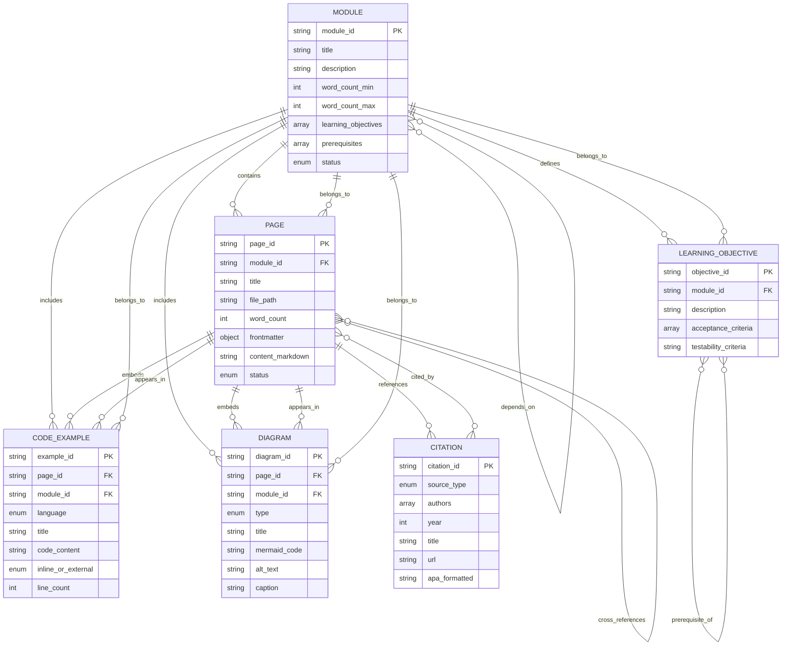

# Data Model: Humanoid Robotics Book Content Entities

**Feature**: Humanoid Robotics Book - Four Core Modules
**Date**: 2025-12-04
**Phase**: Phase 1 - Design

## Overview

This document defines the content entities, attributes, relationships, and validation rules for the humanoid robotics book. These entities model the structure and constraints of educational content to be authored in Docusaurus and deployed to GitHub Pages.

---

## Entity Definitions

### 1. Book Module

**Description**: A self-contained learning unit covering a major topic area in humanoid robotics.

**Attributes**:
- `module_id` (string, required): Priority-based identifier (P1, P2, P3, P4)
- `title` (string, required): Module name (e.g., "The Robotic Nervous System (ROS 2)")
- `description` (string, required): Brief summary of module scope
- `word_count_min` (integer, required): Minimum word count for module content
- `word_count_max` (integer, required): Maximum word count for module content
- `learning_objectives` (array<string>, required): List of skills/knowledge readers will gain
- `prerequisites` (array<string>, optional): Other modules that must be completed first
- `status` (enum, required): One of [Draft, In Progress, Review, Complete, Published]
- `deliverables` (object, required): Required artifacts (pages, examples, diagrams)
- `acceptance_criteria` (array<string>, required): Testable success conditions

**Relationships**:
- `has_many` Pages (1:N)
- `has_many` Code Examples (1:N)
- `has_many` Diagrams (1:N)
- `has_many` Learning Objectives (1:N)
- `depends_on_many` Modules (M:N) - prerequisite dependencies

**Validation Rules**:
1. `module_id` must be unique across all modules
2. `word_count_min` < `word_count_max`
3. `word_count_min` ≥ 4000 (spec.md FR-006)
4. `word_count_max` ≤ 8000 (spec.md FR-030)
5. `learning_objectives` must have at least 1 item
6. `acceptance_criteria` must map to spec.md user story scenarios
7. All prerequisite `module_id` values must reference existing modules

**Example Instance**:
```yaml
module_id: P1
title: "The Robotic Nervous System (ROS 2)"
description: "Foundational module teaching ROS 2 architecture, Python integration, and URDF modeling for humanoid robots."
word_count_min: 4000
word_count_max: 6000
learning_objectives:
  - "Explain ROS 2 nodes, topics, services, and actions with examples"
  - "Map humanoid control to ROS 2 communication patterns"
  - "Interpret URDF robot descriptions"
  - "Trace data flow from Python → ROS 2 → Controllers"
prerequisites: []
status: Draft
deliverables:
  pages: 4
  code_examples: 4
  diagrams: 1
acceptance_criteria:
  - "Reader can explain what a ROS 2 node is and why humanoid control uses multiple nodes"
  - "Reader can identify whether to use a topic, service, or action for a given scenario"
  - "Reader can identify links and joints in a URDF snippet"
```

---

### 2. Page

**Description**: A single Markdown document representing one topic or section within a module.

**Attributes**:
- `page_id` (string, required): Unique identifier (e.g., "module-1-ros2-nodes-topics")
- `module_id` (string, required): Parent module identifier
- `title` (string, required): Page title displayed in navigation
- `file_path` (string, required): Relative path from docs/ (e.g., "module-1-ros2/nodes-topics.md")
- `word_count` (integer, computed): Actual word count of content
- `frontmatter` (object, required): Docusaurus metadata (title, sidebar_position, description)
- `content_markdown` (string, required): Full Markdown content
- `status` (enum, required): One of [Planned, Drafting, Review, Complete]
- `created_date` (date, required): ISO 8601 format
- `updated_date` (date, required): ISO 8601 format

**Relationships**:
- `belongs_to` Module (N:1)
- `has_many` Citations (1:N)
- `has_many` Code Examples (1:N)
- `has_many` Diagrams (1:N)
- `references_many` Pages (M:N) - internal cross-references

**Validation Rules**:
1. `page_id` must be unique across all pages
2. `module_id` must reference an existing module
3. `file_path` must match pattern `module-{N}-{slug}/*.md`
4. `frontmatter` must include `title` and `sidebar_position` keys
5. `content_markdown` must be valid Markdown (MDX compatible)
6. All internal links must resolve to existing pages or external URLs
7. At least one citation (footnote) must be present unless intro/overview page

**Example Instance**:
```yaml
page_id: "module-1-ros2-nodes-topics"
module_id: "P1"
title: "Nodes and Topics in ROS 2"
file_path: "module-1-ros2/nodes-topics.md"
word_count: 1200
frontmatter:
  title: "Nodes and Topics in ROS 2"
  sidebar_position: 2
  description: "Understanding ROS 2 nodes and the publish-subscribe pattern using topics for humanoid robot control."
status: Complete
created_date: "2025-12-04"
updated_date: "2025-12-04"
```

---

### 3. Code Example

**Description**: Python, YAML, or Bash code snippet demonstrating a robotics concept.

**Attributes**:
- `example_id` (string, required): Unique identifier (e.g., "ros2-minimal-publisher")
- `language` (enum, required): One of [python, yaml, bash, javascript, cpp]
- `title` (string, required): Descriptive name for the example
- `description` (string, required): Explanation of what the code does
- `code_content` (string, required): Full code with comments
- `inline_or_external` (enum, required): One of [inline, external]
- `file_path` (string, optional): Path in static/examples/ if external (e.g., "static/examples/module-1/minimal_publisher.py")
- `line_count` (integer, computed): Number of lines in code
- `page_id` (string, required): Page where example appears
- `module_id` (string, required): Parent module

**Relationships**:
- `belongs_to` Page (N:1)
- `belongs_to` Module (N:1)

**Validation Rules**:
1. `example_id` must be unique across all examples
2. `page_id` and `module_id` must reference existing entities
3. If `inline_or_external` = "inline", `line_count` ≤ 20 (ADR-007)
4. If `inline_or_external` = "external", `file_path` must be specified
5. `code_content` must include at least one comment explaining functionality (spec.md FR-034)
6. `code_content` must be syntactically valid for the specified language (linting recommended)
7. Python examples must use `rclpy` for ROS 2 interactions (spec.md FR-003)

**Example Instance**:
```yaml
example_id: "ros2-minimal-publisher"
language: python
title: "Minimal ROS 2 Publisher"
description: "Simple publisher node that sends string messages to a topic."
code_content: |
  import rclpy
  from rclpy.node import Node
  from std_msgs.msg import String

  class MinimalPublisher(Node):
      def __init__(self):
          super().__init__('minimal_publisher')
          # Create publisher on 'topic' with queue size 10
          self.publisher_ = self.create_publisher(String, 'topic', 10)
          self.timer = self.create_timer(0.5, self.timer_callback)
          self.i = 0

      def timer_callback(self):
          msg = String()
          msg.data = f'Hello World: {self.i}'
          self.publisher_.publish(msg)
          self.get_logger().info(f'Publishing: "{msg.data}"')
          self.i += 1

  def main(args=None):
      rclpy.init(args=args)
      minimal_publisher = MinimalPublisher()
      rclpy.spin(minimal_publisher)
      minimal_publisher.destroy_node()
      rclpy.shutdown()
inline_or_external: inline
line_count: 19
page_id: "module-1-ros2-nodes-topics"
module_id: "P1"
```

---

### 4. Diagram

**Description**: Visual illustration using Mermaid syntax for architecture, workflows, or system relationships.

**Attributes**:
- `diagram_id` (string, required): Unique identifier (e.g., "ros2-architecture-flow")
- `type` (enum, required): One of [architecture, sequence, flowchart, state, graph]
- `title` (string, required): Diagram title
- `mermaid_code` (string, required): Full Mermaid syntax
- `alt_text` (string, required): Accessibility text describing diagram
- `caption` (string, required): Descriptive caption explaining diagram purpose (spec.md FR-035)
- `page_id` (string, required): Page where diagram appears
- `module_id` (string, required): Parent module

**Relationships**:
- `belongs_to` Page (N:1)
- `belongs_to` Module (N:1)

**Validation Rules**:
1. `diagram_id` must be unique across all diagrams
2. `page_id` and `module_id` must reference existing entities
3. `mermaid_code` must be valid Mermaid syntax (test with Mermaid Live Editor)
4. `alt_text` must describe diagram content for screen readers
5. `caption` must explain diagram purpose and context
6. Module 1 must have ≥1 diagram (spec.md FR-005)
7. Modules 2-4 must have ≥3 diagrams each (spec.md FR-013, FR-020)

**Example Instance**:
```yaml
diagram_id: "ros2-architecture-flow"
type: graph
title: "Python → ROS 2 → Controllers Data Flow"
mermaid_code: |
  graph TD
      A[Python Script<br/>rclpy] -->|Publishes Message| B[ROS 2 Topic<br/>std_msgs/String]
      B -->|Subscribes| C[Controller Node<br/>C++/Python]
      C -->|Sends Commands| D[Robot Actuators<br/>Motors/Servos]
      D -->|Feedback| E[Sensor Data<br/>Joint States]
      E -->|Publishes| F[ROS 2 Topic<br/>sensor_msgs/JointState]
      F -->|Subscribes| A
alt_text: "Data flow diagram showing a Python script publishing to a ROS 2 topic, which is subscribed to by a controller node that commands robot actuators and receives sensor feedback."
caption: "Figure 1: High-level architecture showing how Python code communicates with humanoid robot controllers via ROS 2 topics. The bidirectional data flow enables real-time control and feedback."
page_id: "module-1-ros2-index"
module_id: "P1"
```

---

### 5. Citation

**Description**: APA 7th edition reference to official documentation, academic paper, or GitHub repository.

**Attributes**:
- `citation_id` (string, required): Unique identifier (e.g., "ros2-humble-docs")
- `source_type` (enum, required): One of [website, documentation, paper, github, book]
- `authors` (array<string>, required): List of authors (organization name if no individual authors)
- `year` (integer, required): Publication year
- `title` (string, required): Document/paper/page title
- `url` (string, required): Full URL to source
- `apa_formatted` (string, required): Complete APA 7th edition citation
- `verified_date` (date, required): Last date URL was verified accessible

**Relationships**:
- `referenced_by_many` Pages (M:N)

**Validation Rules**:
1. `citation_id` must be unique across all citations
2. `url` must be accessible (return HTTP 200)
3. `apa_formatted` must follow APA 7th edition guidelines (validated manually or via tool)
4. All citations must appear in references.md bibliography page
5. Spec.md FR-033 requires all technical claims cite official documentation

**Example Instance**:
```yaml
citation_id: "ros2-humble-docs"
source_type: documentation
authors: ["Open Robotics"]
year: 2024
title: "ROS 2 Documentation: Humble Hawksbill"
url: "https://docs.ros.org/en/humble/"
apa_formatted: "Open Robotics. (2024). ROS 2 Documentation: Humble Hawksbill. https://docs.ros.org/en/humble/"
verified_date: "2025-12-04"
```

---

### 6. Learning Objective

**Description**: Specific skill or knowledge the reader should gain from a module.

**Attributes**:
- `objective_id` (string, required): Unique identifier (e.g., "ros2-explain-nodes")
- `module_id` (string, required): Parent module
- `description` (string, required): Clear statement of what reader will learn
- `acceptance_criteria` (array<string>, required): Testable conditions proving objective met
- `testability_criteria` (string, required): Method for validating reader achieved objective
- `prerequisite_objectives` (array<string>, optional): Other objectives that must be met first

**Relationships**:
- `belongs_to` Module (N:1)
- `depends_on_many` Learning Objectives (M:N) - prerequisite dependencies

**Validation Rules**:
1. `objective_id` must be unique across all objectives
2. `module_id` must reference an existing module
3. `description` must be measurable and actionable (avoid vague terms like "understand better")
4. `acceptance_criteria` must map to spec.md user story acceptance scenarios
5. All prerequisite `objective_id` values must reference existing objectives

**Example Instance**:
```yaml
objective_id: "ros2-explain-nodes"
module_id: "P1"
description: "Explain what a ROS 2 node is and why humanoid control uses multiple nodes"
acceptance_criteria:
  - "Reader can define 'ROS 2 node' in their own words"
  - "Reader can list at least 3 reasons why humanoid control benefits from multiple nodes (modularity, fault isolation, parallel processing)"
  - "Reader can identify nodes in a simple ROS 2 system diagram"
testability_criteria: "Present reader with a humanoid control scenario and ask them to explain how multiple nodes would be used. Correct answer includes modularity, fault tolerance, and clear responsibility separation."
prerequisite_objectives: []
```

---

## Entity Relationship Diagram



---

## Content Validation Rules Summary

### Module-Level Validation

| Rule | Condition | Spec Reference |
|------|-----------|----------------|
| Word Count Range | 4,000 ≤ total_words ≤ 8,000 (varies by module) | FR-006, FR-014, FR-022, FR-030 |
| Code Example Minimum | Module 1: ≥4 Python examples | FR-003 |
| Diagram Minimum | Module 1: ≥1, Modules 2-4: ≥3 | FR-005, FR-013, FR-020 |
| Learning Objectives | All objectives map to spec.md user stories | User Story Acceptance Scenarios |
| Prerequisites | All prerequisite module_ids exist | Module dependency graph |

### Page-Level Validation

| Rule | Condition | Spec Reference |
|------|-----------|----------------|
| Frontmatter Complete | title, sidebar_position present | Docusaurus requirements |
| Valid Markdown | Parses without errors, MDX compatible | FR-031 (Docusaurus Markdown) |
| Internal Links | All relative links resolve to existing pages | Development Standards |
| Citation Presence | At least 1 footnote (unless intro page) | FR-033 (cite official docs) |
| Cross-References | All page references use correct relative paths | ADR-002 (module structure) |

### Code Example Validation

| Rule | Condition | Spec Reference |
|------|-----------|----------------|
| Inline Length Limit | If inline, line_count ≤ 20 | ADR-007 |
| External File Exists | If external, file_path points to valid file | ADR-007 |
| Comments Present | At least 1 comment explaining functionality | FR-034 |
| Syntax Valid | Code parses without errors for specified language | Development Standards |
| ROS 2 Library | Python examples use rclpy for ROS 2 | FR-003 |

### Diagram Validation

| Rule | Condition | Spec Reference |
|------|-----------|----------------|
| Mermaid Syntax Valid | Parses in Mermaid Live Editor | ADR-006 |
| Alt Text Present | alt_text field non-empty and descriptive | FR-035, Accessibility |
| Caption Descriptive | caption explains diagram purpose | FR-035 |
| Diagram Count | Module 1: ≥1, Modules 2-4: ≥3 | FR-005, FR-013, FR-020 |

### Citation Validation

| Rule | Condition | Spec Reference |
|------|-----------|----------------|
| APA Format | Follows APA 7th edition guidelines | ADR-005 |
| URL Accessible | URL returns HTTP 200 | Technical Accuracy |
| In References.md | Citation appears in bibliography page | ADR-005 |
| Verified Recently | verified_date within last 30 days | Research Phase |

---

## Data Model Completeness

✅ **All entities defined** with attributes, relationships, and validation rules
✅ **Entity relationships** mapped in ERD
✅ **Validation rules** traceable to spec.md functional requirements
✅ **Example instances** provided for each entity type
✅ **Ready for module contract generation** (Phase 1 next step)

**Next Artifact**: Module contracts (contracts/module-1-ros2.md, etc.)
