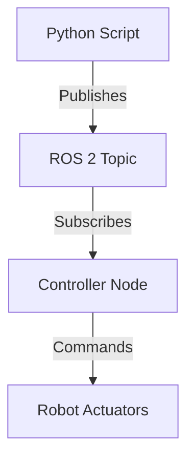

# Quickstart: Contributing to the Humanoid Robotics Book

**Date**: 2025-12-04
**Purpose**: Onboarding guide for contributors authoring content for the humanoid robotics book using Docusaurus

## Prerequisites

Before you begin, ensure you have:

- **Node.js 18+**: [Download from nodejs.org](https://nodejs.org/)
- **Git**: [Download from git-scm.com](https://git-scm.com/)
- **GitHub Account**: [Sign up at github.com](https://github.com/)
- **Text Editor**: VS Code recommended ([code.visualstudio.com](https://code.visualstudio.com/))
- **Basic Python Knowledge**: For reviewing ROS 2 code examples

## Setup

### 1. Clone Repository

```bash
git clone https://github.com/[username]/humanoid-robotics-book.git
cd humanoid-robotics-book
```

### 2. Install Dependencies

```bash
npm install
```

This installs Docusaurus 3.x and all required plugins (Mermaid, MDX, etc.).

### 3. Start Development Server

```bash
npm start
```

Opens your browser to **http://localhost:3000** with live reload enabled. Changes to Markdown files automatically refresh the page.

### 4. Verify Installation

You should see the Docusaurus default homepage. If you see errors, check:
- Node.js version: `node --version` (should be 18+)
- npm version: `npm --version` (should be 8+)
- No port conflicts (3000 is default)

## Project Structure

```
humanoid-robotics-book/
├── docs/                    # Content (Markdown files)
│   ├── intro.md
│   ├── module-1-ros2/       # Module 1: ROS 2 Fundamentals
│   ├── module-2-simulation/ # Module 2: Gazebo & Unity
│   ├── module-3-isaac/      # Module 3: NVIDIA Isaac
│   ├── module-4-vla/        # Module 4: Vision-Language-Action
│   └── references.md        # APA bibliography
├── static/                  # Static assets
│   ├── img/                 # Images and diagrams
│   └── examples/            # Downloadable code snippets
├── src/                     # Docusaurus theme customizations
├── docusaurus.config.js     # Site configuration
├── sidebars.js              # Navigation structure
├── package.json             # Node.js dependencies
└── .specify/                # Spec-Kit Plus configuration
    └── specs/001-humanoid-robotics-book/
        ├── spec.md          # Feature specification
        ├── plan.md          # Implementation plan
        ├── research.md      # Documentation sources
        ├── data-model.md    # Content entities
        └── contracts/       # Module contracts
```

## Adding Content

### Create a New Page

1. Navigate to the appropriate module directory:
   ```bash
   cd docs/module-1-ros2/
   ```

2. Create a Markdown file:
   ```bash
   touch new-topic.md
   ```

3. Add frontmatter at the top:
   ```yaml
   ---
   title: "New Topic Title"
   sidebar_position: 3
   description: "Brief description for SEO and previews"
   ---
   ```

4. Write content using Markdown/MDX syntax

### Embedding Code Examples

**Inline Code (≤20 lines)**:

````markdown
```python
import rclpy
from rclpy.node import Node

class MinimalPublisher(Node):
    def __init__(self):
        super().__init__('minimal_publisher')
        # Create publisher on 'topic' with queue size 10
        self.publisher_ = self.create_publisher(String, 'topic', 10)
```
````

**External Code (>20 lines)**:

1. Create file in `static/examples/module-1/`:
   ```bash
   touch static/examples/module-1/minimal_publisher_full.py
   ```

2. Link from Markdown:
   ```markdown
   For the complete example, download [minimal_publisher_full.py](/examples/module-1/minimal_publisher_full.py).
   ```

### Adding Mermaid Diagrams

````markdown

````

**Caption and Alt Text**:
```markdown
*Figure 1: ROS 2 data flow from Python script to robot actuators.*
```

### Adding Citations

**In-text citation**:
```markdown
ROS 2 uses a publish-subscribe pattern for asynchronous communication[^1].
```

**Footnote** (at page bottom):
```markdown
[^1]: Open Robotics. (2024). ROS 2 Documentation: Topics. https://docs.ros.org/en/humble/Tutorials/Beginner-CLI-Tools/Understanding-ROS2-Topics/Understanding-ROS2-Topics.html
```

**Add to references.md**:
Ensure citation also appears in `docs/references.md` bibliography.

## Testing Locally

### 1. Start Development Server
```bash
npm start
```
- Live reload enabled
- Errors shown in terminal and browser

### 2. Build for Production
```bash
npm run build
```
- Creates `build/` directory
- Fails on broken links or invalid Markdown
- Should complete without errors

### 3. Serve Production Build
```bash
npm run serve
```
- Serves `build/` directory on http://localhost:3000
- Tests production build locally

## Validation Checklist

Before committing, verify:

- [ ] **Build succeeds**: `npm run build` completes without errors
- [ ] **No broken links**: All internal links resolve, external links accessible
- [ ] **Word count**: Module meets target range (see module contract)
- [ ] **Citations**: All technical claims cited in APA format
- [ ] **Code examples**: Include comments, syntactically valid
- [ ] **Diagrams**: Have alt text and descriptive captions
- [ ] **Frontmatter**: All pages have `title` and `sidebar_position`

### Automated Validation

Run content validation script:
```bash
node scripts/validate-content.js
```

Checks:
- Word counts per module
- Code example counts
- Diagram counts
- Citation presence

## Deployment

### Automatic Deployment (GitHub Actions)

Every push to `main` branch triggers:
1. Install dependencies (`npm ci`)
2. Build site (`npm run build`)
3. Deploy to GitHub Pages

View deployment status: https://github.com/[username]/humanoid-robotics-book/actions

### Manual Deployment

```bash
GIT_USER=[username] npm run deploy
```

Deploys `build/` directory to `gh-pages` branch. Site live at:
**https://[username].github.io/humanoid-robotics-book/**

## Citation Guidelines

### APA 7th Edition Format

**Website/Documentation**:
```
Organization. (Year). Page Title. URL
```

**Academic Paper (arXiv)**:
```
Author, A. A., & Author, B. B. (Year). Title. arXiv preprint arXiv:####.#####. URL
```

**GitHub Repository**:
```
Organization. (Year). Repository Name [Software]. GitHub. URL
```

### Example Citations

**ROS 2 Docs**:
```
Open Robotics. (2024). ROS 2 Documentation: Humble Hawksbill. https://docs.ros.org/en/humble/
```

**Whisper**:
```
OpenAI. (2024). Whisper [Software]. GitHub. https://github.com/openai/whisper
```

**Research Paper**:
```
Radford, A., Kim, J. W., Xu, T., et al. (2022). Robust Speech Recognition via Large-Scale Weak Supervision. arXiv preprint arXiv:2212.04356. https://arxiv.org/abs/2212.04356
```

## Troubleshooting

### Build Fails with "Module not found"
```bash
# Clean and reinstall dependencies
rm -rf node_modules package-lock.json
npm install
```

### Port 3000 Already in Use
```bash
# Use different port
PORT=3001 npm start
```

### Broken Links Error
- Check all relative paths use correct format: `../module-1-ros2/page.md`
- Verify external URLs are accessible
- Run link checker: `npm run check-links`

### Mermaid Diagram Doesn't Render
- Verify syntax with [Mermaid Live Editor](https://mermaid.live/)
- Ensure Mermaid plugin installed: check `docusaurus.config.js` for `@docusaurus/theme-mermaid`
- Check for syntax errors (missing quotes, brackets)

## Getting Help

- **Documentation**: https://docusaurus.io/docs
- **Module Contracts**: See `specs/001-humanoid-robotics-book/contracts/`
- **Implementation Plan**: See `specs/001-humanoid-robotics-book/plan.md`
- **Research Sources**: See `specs/001-humanoid-robotics-book/research.md`

## Next Steps

1. Read the module contract for your assigned module (`contracts/module-N-*.md`)
2. Review the data model to understand content structure (`data-model.md`)
3. Start with module index.md page
4. Create content following the contract outline
5. Add code examples and diagrams
6. Cite all technical claims
7. Test build locally
8. Commit and push to trigger deployment

**Happy writing!**
