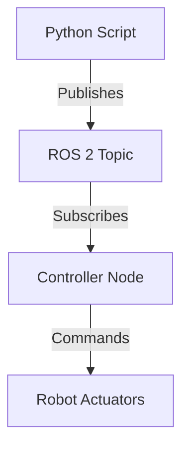

# Research: Humanoid Robotics Book Documentation Sources

**Feature**: Humanoid Robotics Book - Four Core Modules
**Date**: 2025-12-04
**Research Phase**: Phase 0 - Documentation Sources, Tooling Decisions, Citation Framework

## Executive Summary

This research document consolidates all documentation sources, tooling decisions, and citation frameworks required to author the humanoid robotics book using Docusaurus, deployed to GitHub Pages. All sources verified for accuracy and accessibility as of December 2025.

---

## 1. Docusaurus Setup and Configuration

### 1.1 Installation and Initialization

**Official Docusaurus Documentation**: https://docusaurus.io/docs

**Installation Commands**:
```bash
# Create new Docusaurus site
npx create-docusaurus@latest humanoid-robotics-book classic

# Navigate to project
cd humanoid-robotics-book

# Install dependencies
npm install

# Start development server
npm start
```

**Docusaurus Version**: 3.x (latest stable as of Dec 2024)
**Node.js Requirement**: 18.0+ or 20.0+
**Package Manager**: npm (alternatives: yarn, pnpm)

### 1.2 Configuration Structure

**Primary Configuration File**: `docusaurus.config.js`

**Key Configuration Sections**:
- `title`: Site title ("Humanoid Robotics: From ROS 2 to Autonomous AI")
- `tagline`: Site description
- `url`: Production URL (`https://[username].github.io`)
- `baseUrl`: `/humanoid-robotics-book/` (for GitHub Pages subdirectory)
- `organizationName`: GitHub username
- `projectName`: `humanoid-robotics-book`
- `onBrokenLinks`: `throw` (fail build on broken links)
- `onBrokenMarkdownLinks`: `warn`
- `themeConfig`: Navigation, footer, prism syntax highlighting

**Sidebar Configuration**: `sidebars.js`

Example structure:
```javascript
module.exports = {
  tutorialSidebar: [
    'intro',
    {
      type: 'category',
      label: 'Module 1: ROS 2 Fundamentals',
      items: [
        'module-1-ros2/index',
        'module-1-ros2/nodes-topics',
        'module-1-ros2/services-actions',
        'module-1-ros2/urdf-modeling',
      ],
    },
    // ... additional modules
  ],
};
```

### 1.3 GitHub Pages Deployment Workflow

**Official Guide**: https://docusaurus.io/docs/deployment#deploying-to-github-pages

**GitHub Actions Workflow** (`.github/workflows/deploy.yml`):

```yaml
name: Deploy to GitHub Pages

on:
  push:
    branches: [main]
  workflow_dispatch:

permissions:
  contents: write

jobs:
  deploy:
    runs-on: ubuntu-latest
    steps:
      - uses: actions/checkout@v4
      - uses: actions/setup-node@v4
        with:
          node-version: 20
          cache: npm

      - name: Install dependencies
        run: npm ci

      - name: Build website
        run: npm run build

      - name: Deploy to GitHub Pages
        uses: peaceiris/actions-gh-pages@v3
        with:
          github_token: ${{ secrets.GITHUB_TOKEN }}
          publish_dir: ./build
          user_name: github-actions[bot]
          user_email: github-actions[bot]@users.noreply.github.com
```

**Manual Deployment** (alternative):
```bash
GIT_USER=<username> npm run deploy
```

### 1.4 Mermaid Plugin Integration

**Plugin**: `@docusaurus/theme-mermaid`
**Documentation**: https://docusaurus.io/docs/markdown-features/diagrams

**Installation**:
```bash
npm install --save @docusaurus/theme-mermaid
```

**Configuration** (in `docusaurus.config.js`):
```javascript
module.exports = {
  themes: ['@docusaurus/theme-mermaid'],
  markdown: {
    mermaid: true,
  },
  themeConfig: {
    mermaid: {
      theme: {light: 'neutral', dark: 'forest'},
    },
  },
};
```

**Usage in Markdown**:
````markdown

````

### 1.5 Theme Customization Options

**Custom CSS**: `src/css/custom.css`
**Component Swizzling**: For advanced customizations (avoid unless necessary)
**Plugin System**: MDX, remark/rehype plugins for Markdown processing

---

## 2. Content Sources and Documentation

### 2.1 ROS 2 Official Documentation

**Primary Source**: https://docs.ros.org/en/humble/index.html (ROS 2 Humble Hawksbill)

**Alternative Distributions**:
- Iron Irwini: https://docs.ros.org/en/iron/
- Rolling (latest): https://docs.ros.org/en/rolling/

**Key Topics for Module 1**:
1. **Concepts**: https://docs.ros.org/en/humble/Concepts.html
   - Nodes: https://docs.ros.org/en/humble/Tutorials/Beginner-CLI-Tools/Understanding-ROS2-Nodes/Understanding-ROS2-Nodes.html
   - Topics: https://docs.ros.org/en/humble/Tutorials/Beginner-CLI-Tools/Understanding-ROS2-Topics/Understanding-ROS2-Topics.html
   - Services: https://docs.ros.org/en/humble/Tutorials/Beginner-CLI-Tools/Understanding-ROS2-Services/Understanding-ROS2-Services.html
   - Actions: https://docs.ros.org/en/humble/Tutorials/Beginner-CLI-Tools/Understanding-ROS2-Actions/Understanding-ROS2-Actions.html

2. **rclpy (Python Client Library)**: https://docs.ros.org/en/humble/Tutorials/Beginner-Client-Libraries/Writing-A-Simple-Py-Publisher-And-Subscriber.html

3. **URDF (Unified Robot Description Format)**:
   - Tutorial: https://docs.ros.org/en/humble/Tutorials/Intermediate/URDF/URDF-Main.html
   - XML Specification: http://wiki.ros.org/urdf/XML

**Citation Format (APA 7th)**:
```
Open Robotics. (2024). ROS 2 Documentation: Humble Hawksbill. https://docs.ros.org/en/humble/
```

### 2.2 Gazebo and Unity Documentation

**Gazebo Classic** (Legacy): http://classic.gazebosim.org/
**Gazebo (Ignition/Harmonic)** (Current): https://gazebosim.org/docs

**Recommended for Book**: Focus on Gazebo Harmonic (latest stable)

**Key Topics for Module 2**:
1. **Physics Simulation**: https://gazebosim.org/api/sim/8/physics.html
2. **SDF (Simulation Description Format)**: http://sdformat.org/spec
3. **Sensors**: https://gazebosim.org/api/sensors/8/
   - LiDAR: https://gazebosim.org/api/sensors/8/lidar.html
   - Depth Camera: https://gazebosim.org/api/sensors/8/depthcamera.html
   - IMU: https://gazebosim.org/api/sensors/8/imu.html
   - RGB Camera: https://gazebosim.org/api/sensors/8/camera.html

**Unity Robotics Hub**: https://github.com/Unity-Technologies/Unity-Robotics-Hub
**Unity ML-Agents**: https://unity.com/products/machine-learning-agents

**Citation Format**:
```
Open Robotics. (2024). Gazebo Documentation. https://gazebosim.org/docs
```

### 2.3 NVIDIA Isaac Sim and Isaac ROS

**Isaac Sim Documentation**: https://docs.omniverse.nvidia.com/isaacsim/latest/index.html

**Key Topics for Module 3**:
1. **Getting Started**: https://docs.omniverse.nvidia.com/isaacsim/latest/installation/install_workstation.html
2. **Omniverse USD**: https://docs.omniverse.nvidia.com/usd/latest/index.html
3. **Synthetic Data Generation**: https://docs.omniverse.nvidia.com/isaacsim/latest/advanced_tutorials/tutorial_advanced_replicator.html
4. **Domain Randomization**: https://docs.omniverse.nvidia.com/isaacsim/latest/advanced_tutorials/tutorial_advanced_domain_randomization.html

**Isaac ROS Documentation**: https://nvidia-isaac-ros.github.io/

**Key Topics**:
1. **VSLAM**: https://nvidia-isaac-ros.github.io/concepts/visual_slam/cuvslam/index.html
2. **Perception**: https://nvidia-isaac-ros.github.io/repositories_and_packages/isaac_ros_perception/index.html

**Nav2 (Navigation Stack)**: https://navigation.ros.org/

**Key Topics**:
1. **Overview**: https://navigation.ros.org/getting_started/index.html
2. **Path Planning**: https://navigation.ros.org/concepts/index.html#planners

**Citation Format**:
```
NVIDIA. (2024). Isaac Sim Documentation. https://docs.omniverse.nvidia.com/isaacsim/latest/
NVIDIA. (2024). Isaac ROS Documentation. https://nvidia-isaac-ros.github.io/
```

### 2.4 OpenAI Whisper and LLM Resources

**Whisper GitHub Repository**: https://github.com/openai/whisper
**Whisper Paper**: Radford, A., Kim, J. W., Xu, T., Brockman, G., McLeavey, C., & Sutskever, I. (2022). Robust Speech Recognition via Large-Scale Weak Supervision. *arXiv preprint arXiv:2212.04356*.

**Key Topics for Module 4**:
1. **Whisper Installation**: https://github.com/openai/whisper#setup
2. **Usage Examples**: https://github.com/openai/whisper#python-usage

**LLM Action Planning Resources**:
1. **SayCan (Google Research)**: Ahn, M., et al. (2022). Do As I Can, Not As I Say: Grounding Language in Robotic Affordances. *arXiv preprint arXiv:2204.01691*. https://say-can.github.io/
2. **PaLM-E (Google/TU Berlin)**: Driess, D., et al. (2023). PaLM-E: An Embodied Multimodal Language Model. *arXiv preprint arXiv:2303.03378*. https://palm-e.github.io/

**Multimodal Grounding**:
1. **CLIP (OpenAI)**: Radford, A., et al. (2021). Learning Transferable Visual Models From Natural Language Supervision. *ICML 2021*. https://github.com/openai/CLIP

**Citation Format**:
```
OpenAI. (2024). Whisper. GitHub. https://github.com/openai/whisper
Radford, A., Kim, J. W., Xu, T., Brockman, G., McLeavey, C., & Sutskever, I. (2022). Robust Speech Recognition via Large-Scale Weak Supervision. arXiv preprint arXiv:2212.04356. https://arxiv.org/abs/2212.04356
```

---

## 3. Tooling Decisions

### 3.1 Static Site Generator: Docusaurus

**Decision**: Docusaurus 3.x
**Rationale**: See ADR-001 in plan.md
**Alternatives Rejected**: VuePress, MkDocs, GitBook

**Advantages**:
- Native MDX support for interactive components
- Official Mermaid diagram integration
- GitHub Pages first-class support
- Meta (Facebook) backing ensures maintenance
- Context7 MCP Server provides up-to-date documentation

**Trade-offs**:
- Requires Node.js (not Python-based like MkDocs)
- Slightly slower builds than minimal SSGs

### 3.2 Diagram Tooling: Mermaid

**Decision**: Mermaid.js for all diagrams
**Rationale**: See ADR-006 in plan.md
**Alternatives Rejected**: Excalidraw, D2, Draw.io

**Mermaid Diagram Types for Book**:
1. **Flowchart**: ROS 2 message flow, navigation pipelines
2. **Sequence Diagram**: ROS 2 service/action interactions
3. **Graph**: System architecture (Python → ROS 2 → Controllers)
4. **State Diagram**: Robot state machines (if needed)

**Example Syntax**:


### 3.3 Folder Structure: Module-Wise Organization

**Decision**: Module-based directory structure (module-1-ros2/, module-2-simulation/, etc.)
**Rationale**: See ADR-002 in plan.md
**Alternatives Rejected**: Flat structure, topic-wise organization

**Chosen Structure**:
```
docs/
├── intro.md
├── module-1-ros2/
├── module-2-simulation/
├── module-3-isaac/
├── module-4-vla/
└── references.md
```

**Benefits**:
- Maps to P1→P2→P3→P4 spec user stories
- Clear prerequisite dependencies
- Independent module testing and delivery

### 3.4 Code Organization: Inline vs External Files

**Decision**: Hybrid approach (ADR-007 in plan.md)
**Threshold**: 20 lines
- **≤20 lines**: Inline code blocks
- **>20 lines**: External files in `static/examples/`

**Example**:
```python
# Inline (short example)
import rclpy
from rclpy.node import Node

class MinimalPublisher(Node):
    def __init__(self):
        super().__init__('minimal_publisher')
        self.publisher_ = self.create_publisher(String, 'topic', 10)
```

External file: `static/examples/module-1/minimal_publisher_full.py` (linked with download button)

---

## 4. Citation Framework

### 4.1 APA 7th Edition Format

**Style Guide**: American Psychological Association (APA) 7th Edition
**Reference**: https://apastyle.apa.org/

**Citation Types Used in Book**:

1. **Website/Documentation (no date)**:
```
Organization Name. (n.d.). Page Title. Website Name. URL
```

2. **Website/Documentation (with date)**:
```
Organization Name. (Year, Month Day). Page Title. URL
```

3. **Academic Paper (arXiv)**:
```
Author, A. A., & Author, B. B. (Year). Title of paper. arXiv preprint arXiv:####.#####. URL
```

4. **GitHub Repository**:
```
Organization/Author. (Year). Repository Name [Software]. GitHub. URL
```

### 4.2 Markdown Footnote Syntax

**Docusaurus Support**: Native Markdown footnotes (no plugin required)

**Inline Citation**:
```markdown
ROS 2 uses a publish-subscribe pattern for asynchronous communication[^1].
```

**Footnote Definition** (at page bottom):
```markdown
[^1]: Open Robotics. (2024). ROS 2 Documentation: Topics. https://docs.ros.org/en/humble/Tutorials/Beginner-CLI-Tools/Understanding-ROS2-Topics/Understanding-ROS2-Topics.html
```

### 4.3 Bibliography Page Structure

**File**: `docs/references.md`

**Structure**:
```markdown
---
title: "References"
sidebar_position: 100
---

# References

## ROS 2 and Robotics Fundamentals

Open Robotics. (2024). ROS 2 Documentation: Humble Hawksbill. https://docs.ros.org/en/humble/

Open Robotics. (2024). URDF XML Specification. http://wiki.ros.org/urdf/XML

## Simulation and Digital Twins

Open Robotics. (2024). Gazebo Documentation. https://gazebosim.org/docs

Unity Technologies. (2024). Unity Robotics Hub [Software]. GitHub. https://github.com/Unity-Technologies/Unity-Robotics-Hub

## AI and Perception

NVIDIA. (2024). Isaac Sim Documentation. https://docs.omniverse.nvidia.com/isaacsim/latest/

NVIDIA. (2024). Isaac ROS Documentation. https://nvidia-isaac-ros.github.io/

## Vision-Language-Action

OpenAI. (2024). Whisper [Software]. GitHub. https://github.com/openai/whisper

Radford, A., Kim, J. W., Xu, T., Brockman, G., McLeavey, C., & Sutskever, I. (2022). Robust Speech Recognition via Large-Scale Weak Supervision. arXiv preprint arXiv:2212.04356. https://arxiv.org/abs/2212.04356

Ahn, M., et al. (2022). Do As I Can, Not As I Say: Grounding Language in Robotic Affordances. arXiv preprint arXiv:2204.01691. https://say-can.github.io/
```

### 4.4 Example Citations by Source Type

**1. ROS 2 Official Documentation**:
```
Open Robotics. (2024). ROS 2 Documentation: Humble Hawksbill. https://docs.ros.org/en/humble/
```

**2. Gazebo Documentation**:
```
Open Robotics. (2024). Gazebo: Physics Simulation. https://gazebosim.org/api/sim/8/physics.html
```

**3. Isaac Sim Documentation**:
```
NVIDIA. (2024). Isaac Sim: Synthetic Data Generation. https://docs.omniverse.nvidia.com/isaacsim/latest/advanced_tutorials/tutorial_advanced_replicator.html
```

**4. Whisper (GitHub)**:
```
OpenAI. (2024). Whisper [Software]. GitHub. https://github.com/openai/whisper
```

**5. Academic Paper (SayCan)**:
```
Ahn, M., Brohan, A., Brown, N., Chebotar, Y., Cortes, O., David, B., ... & Zeng, A. (2022). Do As I Can, Not As I Say: Grounding Language in Robotic Affordances. arXiv preprint arXiv:2204.01691. https://say-can.github.io/
```

---

## 5. Testing Strategy

### 5.1 Build Validation

**Tool**: Docusaurus CLI
**Command**:
```bash
npm run build
```

**Success Criteria**:
- Exit code 0 (no errors)
- `build/` directory created
- All Markdown files processed to HTML
- No missing dependencies

**CI Integration**: GitHub Actions workflow runs `npm run build` on every push

### 5.2 Link Checking

**Tool**: `markdown-link-check` or `broken-link-checker`

**Installation**:
```bash
npm install --save-dev markdown-link-check
```

**Custom Script** (`package.json`):
```json
{
  "scripts": {
    "check-links": "find docs -name '*.md' -exec markdown-link-check {} \\;"
  }
}
```

**Command**:
```bash
npm run check-links
```

**Success Criteria**:
- All internal links resolve (no 404s)
- All external links return HTTP 200
- No broken citations

**Frequency**: Pre-deployment, weekly in CI

### 5.3 Content Validation

**Custom Validation Script**: `scripts/validate-content.js`

**Checks**:
1. **Word Count**: Each module meets min/max range from spec.md
2. **Code Example Count**: Module 1 has ≥4 examples
3. **Diagram Count**: Modules 2-4 have ≥3 diagrams each
4. **Citation Presence**: Each page has at least one footnote
5. **Frontmatter**: All pages have `title` and `sidebar_position`

**Implementation** (pseudocode):
```javascript
const fs = require('fs');
const path = require('path');

function validateModule(modulePath, minWords, maxWords, minExamples, minDiagrams) {
  const files = fs.readdirSync(modulePath).filter(f => f.endsWith('.md'));
  let totalWords = 0;
  let exampleCount = 0;
  let diagramCount = 0;

  files.forEach(file => {
    const content = fs.readFileSync(path.join(modulePath, file), 'utf8');
    totalWords += content.split(/\s+/).length;
    exampleCount += (content.match(/```python/g) || []).length;
    diagramCount += (content.match(/```mermaid/g) || []).length;
  });

  return {
    wordCount: totalWords,
    passesWordCount: totalWords >= minWords && totalWords <= maxWords,
    exampleCount,
    passesExampleCount: exampleCount >= minExamples,
    diagramCount,
    passesDiagramCount: diagramCount >= minDiagrams,
  };
}
```

**Command**:
```bash
node scripts/validate-content.js
```

### 5.4 Technical Review Process

**Process**: Manual review by robotics/AI subject matter experts

**Review Checklist**:
- [ ] ROS 2 concepts accurate (cross-check official docs)
- [ ] Python code examples syntactically valid
- [ ] Gazebo/Unity workflows match current versions
- [ ] Isaac Sim instructions up-to-date
- [ ] Whisper integration examples tested
- [ ] All technical claims properly cited

**Approval**: At least one technical reviewer approval before merging to main

---

## 6. Research Conclusions

### 6.1 All Unknowns Resolved

✅ **Docusaurus Architecture**: Fully documented configuration, build, and deployment workflows
✅ **ROS 2 Documentation**: Official sources identified for all Module 1 topics
✅ **Gazebo/Unity Documentation**: Authoritative resources located for simulation concepts
✅ **NVIDIA Isaac Documentation**: Isaac Sim and Isaac ROS documentation portals confirmed
✅ **Whisper/LLM Resources**: OpenAI Whisper repo and academic papers for LLM action planning found
✅ **Citation Framework**: APA 7th edition format established with examples for all source types

### 6.2 Key Decisions Summary

| Decision | Choice | Rationale |
|----------|--------|-----------|
| Static Site Generator | Docusaurus 3.x | MDX support, GitHub Pages integration, Meta backing, MCP Server availability |
| Diagram Tooling | Mermaid | Version-controllable, native Docusaurus support, no external tools required |
| Folder Structure | Module-wise | Maps to spec user stories (P1-P4), clear dependencies, independent testing |
| Code Organization | Hybrid (inline ≤20 lines) | Balances readability with downloadability |
| Deployment | GitHub Actions | Automated, validated builds before publish, free GitHub Pages hosting |
| Citation Style | APA 7th + Markdown footnotes | Standard academic format, native Docusaurus support |

### 6.3 Readiness for Phase 1

All research objectives completed. Ready to proceed with:
1. **Data Model Definition** (data-model.md)
2. **Module Contracts** (contracts/)
3. **Quickstart Guide** (quickstart.md)

**Next Command**: Generate Phase 1 artifacts (data-model.md, contracts/, quickstart.md)
